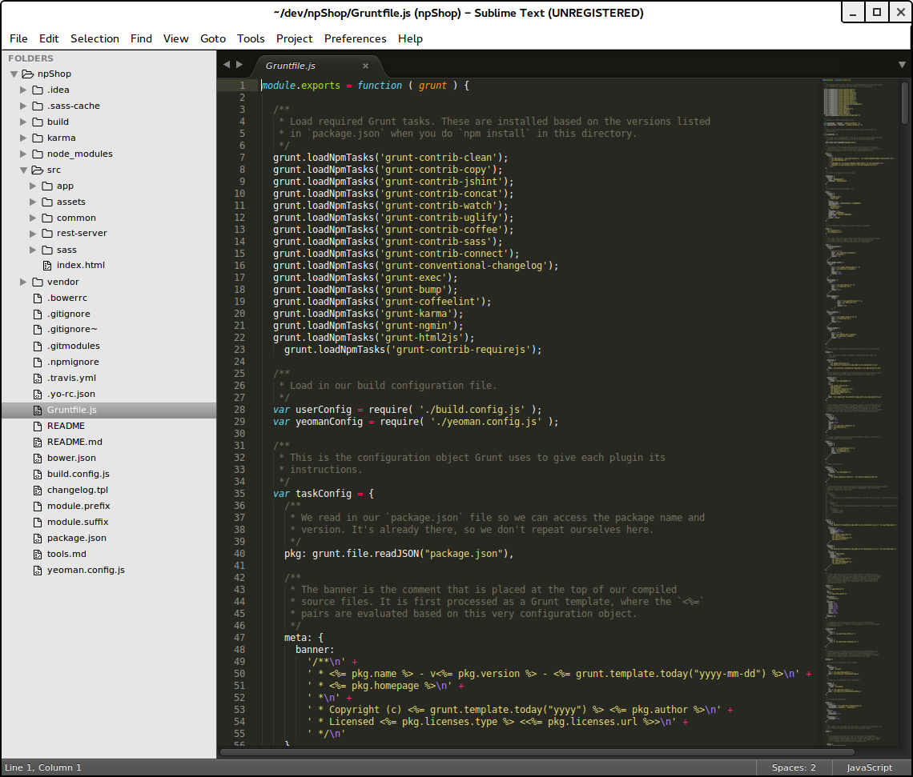

In Teil 1 der Beitragsreihe zum Thema Frontend-Entwicklung mit Grunt bin ich darauf eingegangen, was Grunt ist und wie Grunt funktioniert. In Teil 2 möchte ich genauer darauf eingehen, mit welchen Techniken vermieden werden kann, dass das Gruntfile unübersichtlich und schwer wartbar wird.

# Schwer wartbare Gruntfiles

In Entwicklungsprojekten kann es schnell passieren, dass sehr viel Grunt-Plugins (z.B. für minifying, uglifying, etc.) nötig sind, so dass das Gruntfile aufgrund der benötigten *loadNpmTasks* Anweisungen länger und länger wird. Weiterhin sorgen die einzelnen Konfigurationen für die verschiedenen Plugins und Tasks dafür, dass das Gruntfile zunehmend unübersichtlicher wird.

Es wäre doch schön, wenn zusammengehörige Einheiten in einzelne Dateien ausgelagert werden und Redundanzen vermieden werden können. Und genau das ist möglich, was ich im Folgenden zeigen werde. Hier ist zu sagen, dass es viele Möglichkeiten gibt, diese Ziele zu erreichen und mein Setup nur eine von mehreren Lösungen darstellt.

# Variablen verwenden

Eine Möglichkeit [DRY (Don't Repeat Yourself)](http://de.wikipedia.org/wiki/Don%E2%80%99t_repeat_yourself) Gruntfiles zu schreiben, ist die Verwendung von Variablen, wie das folgende Snippet zeigt. 


module.exports = function (grunt) {
  var globalConfig = {
    src: 'src',
    dest: 'dev'
  };

  grunt.initConfig({
    globalConfig: globalConfig,
    compass: {
      options: {
        sassDir: '<%= globalConfig.src  %>/styles',
        cssDir: '<%= globalConfig.dest %>'
      },
      dev: {}
    }
// ...


Wir sehen später, dass diese Variablen auch in den ausgelagerten Dateien verwendet werden können.

# Task Aliase definieren

Mit Task Aliases können existierende Tasks und Task Aliases kombiniert werden. Im folgenden Beispiel werden beispielsweise durch Aufruf des Task Aliases *js* die Tasks *jshint*, *concat* und *uglify* nacheinander verarbeitet.


grunt.registerTask('js', ['jshint', 'concat', 'uglify']);
  grunt.registerTask('css', ['sass:dev']);
  grunt.registerTask('html', ['slim', 'htmlmin']);
  grunt.registerTask('default', ['js', 'css', 'html', 'copy', 'watch']);


# Vermeiden von redundanter Plugin-Definition

Wenn wir uns die beiden nächsten Snippets anschauen, so fällt auf, dass das Grunt-Plugin *jshint* doppelt deklariert werden muss. Einmal muss in der *package.json* via npm das entsprechende Plugin spezifiziert werden und dann muss nocheinmal redundant das Plugin via *loadNpmTasks* Aufruf im Gruntfile eingebunden werden. 


  // package.json
  { 
    "devDependencies": {
      "grunt": "~0.4.1",
      "grunt-contrib-jshint": "~0.6.0"
  }
}



  // Gruntfile.js
  module.exports = function(grunt) {

    // Load the plugin that provides the "jshint" task.
    grunt.loadNpmTasks('grunt-contrib-jshint');
    // ...  


Besser wäre es, wenn wir nur in der package.json das Plugin spezifizieren müssten und Grunt sich Plugin-Informationen daraus ziehen würde. Das hätte den Vorteil, dass wir bei Änderungen nur an einer Stelle Änderungen vornehmen müssten, getreu nach dem Motto Single Point of Failure.

Das Ganze ist über das Plugin [load-grunt-tasks](https://github.com/sindresorhus/load-grunt-tasks) möglich. Betrachten wir das folgende Beispiel, in dem viele Plugins im Gruntfile angegeben werden.


  // Gruntfile.js
 module.exports = function (grunt) {
  grunt.loadNpmTasks('grunt-shell');
  grunt.loadNpmTasks('grunt-sass');
  grunt.loadNpmTasks('grunt-recess');
  grunt.loadNpmTasks('grunt-sizediff');
  grunt.loadNpmTasks('grunt-svgmin');
  grunt.loadNpmTasks('grunt-styl');
  grunt.loadNpmTasks('grunt-php');
  grunt.loadNpmTasks('grunt-eslint');
  grunt.loadNpmTasks('grunt-concurrent');
  grunt.loadNpmTasks('grunt-bower-requirejs');
  // ...


Dieser Teil können wir durch folgenden Code ersetzen.


  // Gruntfile.js
  module.exports = function (grunt) {
    require('load-grunt-tasks')(grunt);
  // ...


# Task-Konfigurationen auslagern

Ein Gruntfile mit vielen Task-Konfigurationen wird schnell unübersichtlich. Mit dem [load-grunt-configs](https://github.com/creynders/load-grunt-configs) Plugin ist es möglich, Konfigurationen in eigene Dateien auszulagern. Außerdem sind die oben gezeigten Variablen, die im Gruntfile definiert werden, in den ausgelagerten Dateien verwendbar, wie die folgenden beiden Snippets zeigen.


// Gruntfile.js
module.exports = function(grunt) {
  require('load-grunt-tasks')(grunt);  
  var options = {
    project: {
      // project src/target folders
      app: 'app',
      assets: '<%= project.app %>/assets',            
      src: '<%= project.assets %>/src',
      // ...
    }
    // ...
  };
  // ...
  /* 
    Loads the various task registration / configuration files 
    located at config folder.
  */   
  var configs = require('load-grunt-configs')(grunt, options);
  grunt.initConfig(configs);

  grunt.registerTask('js', ['jshint', 'concat', 'uglify']);
  // ...  
}



// config/jshint.json
{
     "options": {
        "curly": true,
        // ...
      },
    "gruntfile" : {
        "src" : "Gruntfile.js"
    },
    "app_js" : {
        "src" : ["<%= project.js %>"]
    }
}


Im Gruntfile werden global verfügbare Variablen definiert und weiter unten im Gruntfile das Plugin initialisiert, welches die im Verzeichnis *config* liegenden ausgelagerten Konfigurationsdateien verarbeitet und zur Verfügung stellt. In diesem Beispiel laden wir die Konfiguration für *jshint* und können diese Konfiguration für die Task-Registrierung verwenden.

Das vorige Beispiel hat die Konfiguration in eine JSON-Datei ausgelagert. Das nächste Snippet zeigt, dass Konfigurationen auch in Form von ausgelagerten Javascript-Dateien erfolgen können.


// config/cssmin.js
module.exports.tasks = {
 "cssmin": {
    "add_banner": {
      "options": {
        "banner": "/* My minified css file */"
      },
      "files": {
        "<%= project.css_dist %>/style.css": 
        ["<%= project.css_gen %>/**/*.css"]
      }
    }
  }
}


# Wie geht es weiter?

Nach dem ich in diesem Teil darauf eingegangen bin, wie das Gruntfile übersichtlich und wartbar gehalten werden kann, möchte ich in Teil 3 auf einen exemplarischen Grunt-Workflow eingehen, wie er in einem typischen Entwicklungsprojekt eingesetzt werden könnte.

