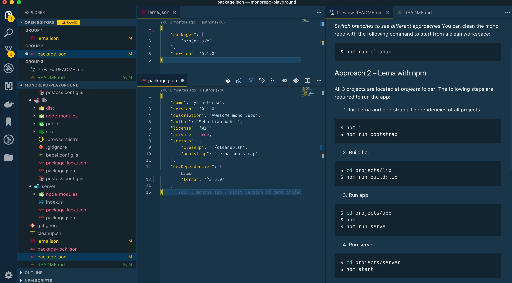
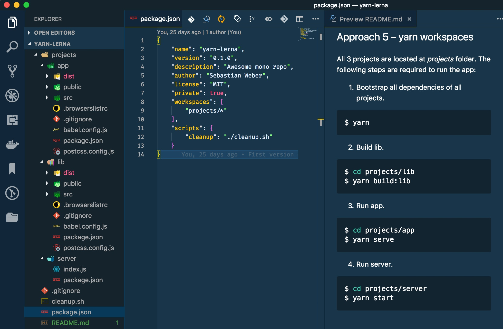

**TODO/Klären**
- 2-3 teilige Blog-Reihe planen: 1. npm Basics / Frontend Projekt Struktur 2. npm vs yarn 3. das hier
- auf Bolt überhaupt eingehen? Nochmal versuchen, zum Laufen zu bringen
- Part 1 und Part 2 machen? Part 1 ist mehr die Theorie und Part 2 geht auf Lerna und Yarn workspaces im Detail ein
- besserer Titel in etwa: How npm, yarn, ... add to the mono-repo formula and why lerna and yarn workspaces is a perfect match

This post is my take on the topic of _Mono-Repo_. After a brief introduction to _Mono-Repo_ and a comparison with _Multi-Repo_, I go into tools to establishing _Mono-Repos_.

I don't want to assess in great detail what repo typ is better in which circumenstance. However, the goal of this article is all about _Mono-Repos_ and how [lerna](https://lernajs.io/), [npm](https://www.npmjs.com/), and [yarn](https://yarnpkg.com) ([workspaces](https://yarnpkg.com/en/package/workspaces)) can help. It also makes sense to use these tools in combination. Especially _lerna_ and _yarn workspaces_ can peacefully coexist in a project. How, we will find out in a minute.

# What is a Mono-Repo? How does it Compare to Multi-Repo?

Tools like _lerna_ and _yarn workspaces_ have been a decisive factor with the result that managing your codebase in a single repo (a.k.a. _Mono-Repo_) has gained some traction for about one or two years. A lot of articles were written or conference talks were given about this topic. I don't want to go to deeply into the theory behind _Mono-Repos_, however, I would like to describe briefly what they are and how they compare to _Multi-repos_ in a way that we have a similar understanding.

**TODO** Mono-repo vs Multi-repo...

# Tool Landscape for Mono-Repos

A _Mono-Repo_ hosts one or more projects or packages. Those packages are &quot;Mini-Repos&quot; that can be versioned, built, and published independently. Therefore, every package contains its own _package.json_ file due to the fact that every package is a full-fledged project on its own.
Packages might have dependency relations between each other. Managing these dependencies are implemented by symlinks.

As we see later, _lerna_ and _yarn workspaces_ give us the ability to build libraries and apps in a single repo without forcing us to publish to npm or other registries. The beauty behind these technologies is that they can find package dependencies by analyzing the _package.json_ files located at each package root folder. Thereby, these tools make it obsolete to manually create symlinks or use &quot;low-level&quot; _npm link_ directly.

This results in faster code-test-debug cycles by sharing components locally. _lerna_ and _yarn workspaces_ together improve the developer experience of managing multiple packages in a _Mono-Repo_.

## Correlation between _npm_, _yarn_, _yarn workspaces_, and _lerna_

I want to shed some light on the clutter how _npm_, _yarn_, _yarn workspaces_, and _lerna_ are involved in the topic of _Mono-repos_. Take a look at the following &quot;set diagram&quot;.


It depicts three main players and how they correlate. By the way, do not take the proportions too seriously. The diagram's purpose is just to give an impression how things are connected. Furthermore, I do not go into great detail because this would go beyond the purpose of this article. If you are interested on more details on this topic, consider my article about **TODO npm vs yarn**.

_npm_ (marked by 1) and _yarn_ (2) are both native package managers that have many features in common (3). As an example, both leverage the concept of _package.json_ as container for dependency management, which was introduced by _npm_ back in the days. More shared concepts and features are dependency management, publishing, or using lock files to &quot;freeze&quot; dependency versions. There are even more features originated by _npm_ that are also leveraged by _yarn_, such as publishing to npm registry.

One of the reasons for creating _yarn_ in the first place was performance &ndash; it took too long to install dependencies in large projects. Another aspect was missing features, such as a sophisticated concept for freezing versions, offline capabilities, or deterministic behavior in terms of dependency resolution. Though, many of these gaps of _npm_ have vanished over the time and both technologies are more and more feature compliant nowadays.

Things that still belong solely to _npm_ (1) or _yarn_ (2) are _package-lock.json_ files or _yarn.lock_ files, respectively. However, for us, the application developers, the different implementation of lock files does not really matter. Practically, _npm_ and _yarn_ are even on how version management is handled.

One big feature that is exclusive to _yarn_ is _yarn workspaces_ (4) that was added to _yarn_ about a year ago. It expands _yarn_ by native mono-repo capabilities. The next section goes more into mono-repo features.

**TODO Beispiele für 1**
**TODO** überlegen, die Grafik abzuändern, so dass (2) viel kleiner ist im Vergleich zu (1) und (3) viel größer dargestellt wird.

## Mono-Repo &ndash; What is native? What is user land?

Consider the next diagram depicting how technologies in the Mono-Repo environment are connected to each other.


Marked in read are technologies that provide Mono-Repo capabilities. All of them are based either on _npm_ or _yarn_. Latter do not provide advanced features for building Mono-Repose besides _npm link_ or _yarn link_, respectively.

[yarn workspaces](https://yarnpkg.com/lang/en/docs/workspaces/) is the only representative that exposes Mono-Repo capabilities natively. [lerna](https://lernajs.io) is around for quite some time and even before _yarn workspaces_ has existed. _lerna_ provide Mono-Repo features on the level of user land with _npm_ or _yarn_ as dependency management tool. It leverages semantic links for this purpose. _lerna_ also allows for using _yarn workspaces_ and, then, leaves the whole Mono-Repo aspect solely to the natively implemented features of _yarn workspaces_. Furthermore, _lerna_ provides sophisticated publishing and version management features to even publish projects independently from each other. Short, _lerna_ offers many features beyond Mono-Repo management. On the other side, _yarn workspaces_ sole purpose is to ease the Mono-Repo workflow. So, you do not have to decide for ether side of them. It does totally make sense to use _lerna_ with _yarn workspaces_.

[bolt](https://github.com/boltpkg/bolt) is a relatively new project that bases on _yarn workspaces_. Inspired by _lerna_, its goal is to add more helpful commands on this foundation.

# Lerna and / or Yarn Workspaces

## Lerna

## Yarn Workspaces

## Advanced Frontend Workflow Features and Commands

# Mono-Repo Tooling &quot;Cheatsheets&quot;

This section's goal is to give a quick overview on how to set up the different tools in different variations. You can understand the screenshot as a kind of &quot;cheat sheets&quot;. The focus is on the configuration part of the different approaches and how they differ.

I created a small repository to demonstrate the different variants. Just [clone the demo project repo](https://github.com/doppelmutzi/monorepo-playground) and switch branches for the different variants. The _README.md_ file describes how to bootstrap and use (i.e., build and run the dummy app) the particular variant. Another goal of this section and demo project is to provide an easy playground to see the different variants in action from different perspectives: which configuration steps are required, what steps are needed to build and use the sub projects (i.e., packages), how does dependency management work, or what are the timing implications for bootstrapping.

## 1. do it yourself

I skip this section but feel free to checkout branch _1-do-it-yourself_. Basically you work with _npm link_ and have to create semantic links and install all sub projects manually.

## 2. lerna with npm

To get support for automating the manual tasks of approach 1, _lerna_ was introduced. You need a _lerna.json_ file in the root folder. As a convention, _lerna_ uses _npm_ as default. To bootstrap all sub projects, you need to leverage lerna:
```bash
$ npm run bootstrap
```



## 3. lerna with yarn

This is the same setup as with approach 2. The only difference is that you have to specify _yarn_ as client with the &quot;npmClient&quot; property in _lerna.json_ file. Bootstrapping is also done by _lerna_.
.

## 4. yarn workspaces
To use _yarn workspaces_ you need _yarn_ version 1.0 or higher. As you can see in the following screenshot, you do not need a dedicated configuration file. The _package.json_ file in the root folder needs to be private and has to have a _workspaces_ property that tells _yarn_ where to find the sub projects. To bootstrap the project, you just use _yarn_ since _yarn workspaces_ provides this feature natively:
```bash
$ yarn install
```



## 5. lerna with yarn workspaces

To configure _yarn workspaces_ you have to have the same configuration in the root's _package.json_ as described in approach 4. However, you need to provide a _lerna.json_ file in the root folder, too. There, you need to tell _lerna_ to use _yarn workspaces_. Unfortunately, you have to specify the location of the sub projects redundantly in _lerna.json_. To bootstrap the project no _lerna bootstrap_ is required, you just have to use _yarn install_ as described in approach 4.


# Timing Comparison

npm mittlerweile nicht mehr langsamer

# Conclusion
