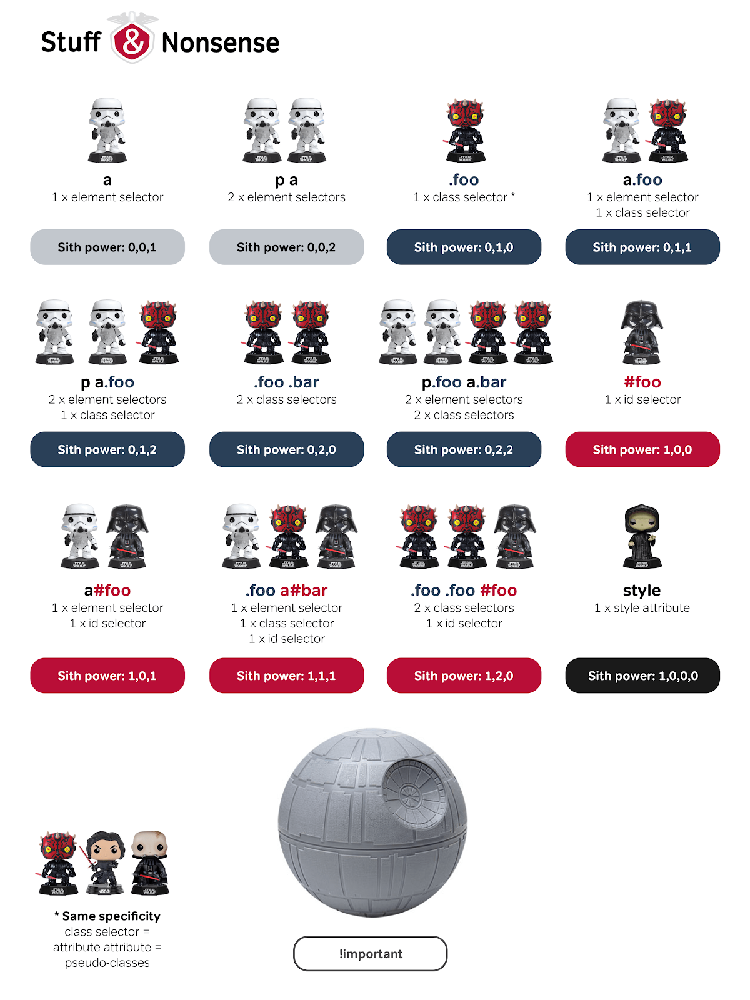
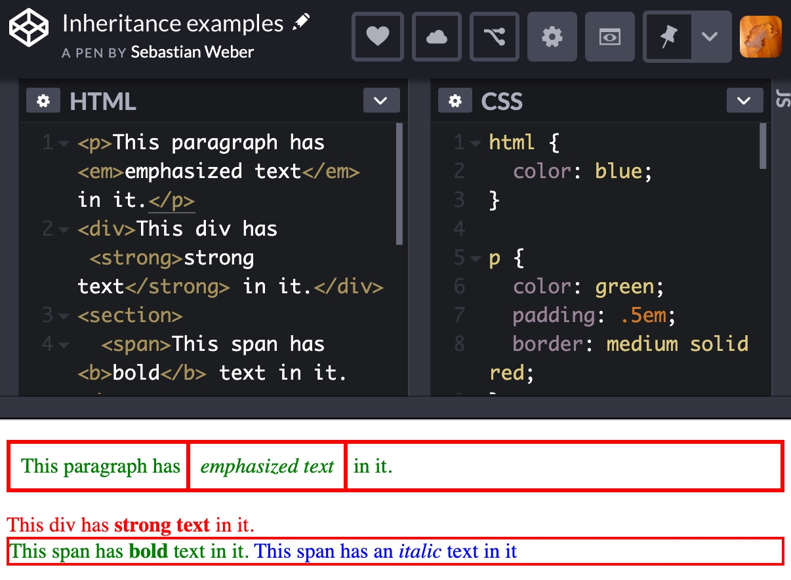
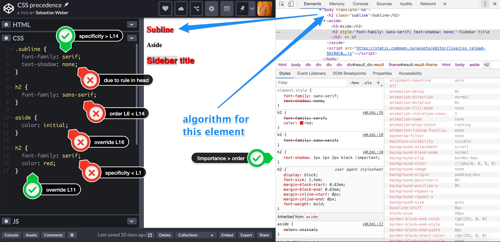

Normally, beginning your journey with CSS entails a steep learning curve. However, mastering CSS is hard since it is such a broad topic in itself. The field of applications is diverse, thus understanding the basics helps you to become a more productive developer.

Sure, having a more or less understanding is most of the time sufficient. Applying the trial and error method until your selectors do what you want does most of the time the job. However, in big projects you will sooner or later struggle with side effects or other weird bugs without understanding precedence in CSS.


# Precedence

As a reminder, take a look at the structure of a CSS rule.


If several CSS rules target the same HTML element and these rules constitute definitions with one or more mutual CSS properties, which styles are applied by the browser in the end? This is where CSS precedence comes into play.

Examples help to make complex situations more understandable. Take a look at the following code snippets (or play around with the [Codepen](https://codepen.io/doppelmutzi/pen/yWLbbL)).

```html
<!-- HTML template code -->

<h2 class="subline">subline</h2>
<aside>
  <h2>sidebar title</h2>
</aside>
```

```css
/* some styles to target h2 elements */

.subline {
  font-family: serif;
}
h2 {
  font-family: sans-serif;
}
aside {
  color: red;
}
```

In the end, the sidebar title element has a sans-serif and red font applied. The subline element has a black serif font.

Several interesting things happened here. There is no selector that explicitly target a `h2` element to assign a font color. However, the red color of the sidebar title was inherited by its parent element (`aside`). The second CSS `font-family` declaration (`h2` selector) was not applied by the subline element because the `.subline` selector was considered as more specific by the browser.

All these aspects are considered to determine which CSS declarations for every DOM element have to be applied. If multiple CSS declarations (e.g., `font-family: serif;` and `font-family: sans-serif;`) with the same CSS property (`color`) are found to target a particular DOM element (e.g., the sidebar title), the browser creates a precedence order. Thereby, the property value with the highest precedence gets applied.

As you can see from this simple example, many aspects play a role in the browser process of determining the actual CSS styles. To be more specific, the following concepts are part of the precedence algorithm:
- specificity
- inheritance
- the cascade

# Specificity

Take a look at the following [CSS snippet](https://codepen.io/doppelmutzi/pen/WZavOm). It shows a bunch of selectors to style `li` elements.

```css

.challenge li::before {
  content: '😃';
  margin-right: .25em;
  vertical-align: middle;
}

.challenge > ul li::before {
  content: '😴';
}

ul[data-smiley='crying'] > li::before {
  content: '😭';
}
```
The corresponding HTML elements are shown next.
```html
<main class="challenge">
  <ul class="list">
    <li>1.1</li>
      <ul class="list">
        <li>2.1</li>
        <li>2.2</li>
        <ul class="list" data-smiley="crying">
          <li>3.1</li>
          <li>3.2</li>
          <li>3.3</li>
        </ul>
        <li>2.3</li>
      </ul>
    <li>1.2</li>
    <li>1.3</li>
  </ul>
</main>

```
If you specify multiple selectors to target the same HTML element, the browser picks the selector with the highest [specificity](https://www.w3.org/TR/selectors-3/#specificity) value.

What is selector specificity all about? Specificity constitutes the amount of importance each CSS declaration block has in comparison with others based on what its selector is made up of. It is important to understand that specificity only relates to the selector. This means, the actual CSS declaration block is irrelevant in the context of specificity. However, specificity values are calculated by the cascade algorithm to bring these CSS declaration blocks in some kind of importance order. Based on this, styles are determined to apply to HTML elements.

The [Specificity Calculator](https://specificity.keegan.st/) is a nice online tool constituting a visual way to understand this concept.


The first selector has a higher specificity because classes are more specific than elements.

You can think of selector specificity as a row vector of 4 elements as depicted by the [illustration of CSS Tricks](https://css-tricks.com/wp-content/csstricks-uploads/specificity-calculationbase.png).


Consider the following examples:
- selector 1 (0,1,0,0) wins over selector 2 (0,0,0,41)
- selector 1 (0,2,0,1) wins over selector 2 (0,1,2,15)

Take a look at the following example that consist of two special cases.
```css
  * {
    color: red;
  }

  h1#title {
    color: blue;
  }

  h1 {
    color: green !important;
  }
```
The universal selector (`*`) has a specificity of (0,0,0,0). The `!important` keyword beats everything, thus use it with care (or better don't use it). In the example, every `h1` element has a green color, even the element with the id `title`. To override such a declaration, your only chance is to specify another declaration with `!important`, so order is relevant.

Over 10 years ago, Andy Clarke published an awesome [article explaining selector specificity through Star Wars](https://stuffandnonsense.co.uk/archives/css_specificity_wars.html).



It is a fun way to learn the concept of specificity. I also recommend Emma Wedekind's [in-depth explanation of CSS specificity](https://dev.to/emmawedekind/css-specificity-1kca).

# Inheritance

Inheritance controls what happens if no value for a CSS property has been defined for an element. To be more precise, the inheritance mechanism propagates CSS property values from a parent element to its child elements. However, not every property value gets inherited. MDN's CSS property reference can be used to find out if the values of a particular property gets inherited or not. As you can see from in the following screenshot, `margin` does not get inherited by default.


A [comprehensive list of all CSS properties](https://www.w3.org/TR/CSS21/propidx.html) with information about inheritance provides W3C.


Consider the following example.
```html
<article>
  <h2>Title</h2>
  <p>Lorem Ipsum</p>
</article>
```

```css
article {
  margin: 10px;
}

p {
  margin: inherit;
}
```
By using the `inherit` keyword, the `margin` property value of the `article` element gets propagated to the `p` element. In contrast, the `h2` element does not inherit the `margin` value of its parent since `margin` does not get inherited by default.

The following [Codepen](https://codepen.io/doppelmutzi/pen/NaOGER?editors=1100) constitutes a more comprehensive example of CSS inheritance.


# The Cascade

CSS stands for _Cascading Style Sheets_, so it is not surprising that the cascade plays an important role. This algorithm calculates the above explained precedence for all CSS declarations. Thereby, it also considers specificity and inheritance to determine which styles are applied to every HTML element of your HTML document.

The simplified algorithm looks like this (for complete details refer [W3C specification](https://www.w3.org/TR/CSS2/cascade.html#cascade)). The algorithm is executed for every HTML element:

* Collect every CSS declaration that comes into question for the current HTML element.
* Sort these declarations by _origin_ and _weight_.
  * Origin refers to the location where the declaration is specified (e.g., inline styles as `style` attribute or within an externally defined stylesheet file).
  * Weight equals importance of the declaration, i.e., author styles (styles that we developer provide) > user styles (styles specified by end-users, e.g., [in Firefox](https://davidwalsh.name/firefox-user-stylesheet)) > browser defaults (e.g., most desktop browsers define `16px` as default `font-size` for `html` elements).
  * The following rules are valid for _author styles_: inline styles > styles defined within the `head` element > styles part of external files
  * `!importance` (e.g., `p { color: red !important; }`) constitutes a higher weight than normal CSS declarations.
* Sort all selectors targeting the current HTML element by specificity values (the highest value on top of the list).
* Are two CSS declarations equal regarding all rules above, the declaration wins that is specified later in terms of document flow. So _order_ acts as tie-breaker in such situations. Order comprises the location where styles are integrated: integrated external stylesheets within the `head` element but also imported stylesheets (with `@import` declaration) from within external stylesheet files.

The following [illustration](https://srjcstaff.santarosa.edu/~tfleming/htmlb/CSS_Cheat_Sheet_Inheritance_Cascade_Specificity.pdf) explains the algorithm in a nutshell.


Let's briefly discuss how the cascade effects on inheritance. What happens if you have two ancestors of an element with the same properties that gets propagated down the document tree due to inheritance? Ultimately, the property values of the ancestor that is closest to the element are applied.

If you would like to have another perspective on the cascade, I recommend [Benjamin Johnson's article](https://blog.logrocket.com/how-css-works-understanding-the-cascade-d181cd89a4d8).

# Utilize browser dev tools

Developer tools of modern browsers are very helpful to grasp the concept explained in this article. The next annotated screenshot shows how information regarding inheritance and precedence (crossed out declarations, origin of styles, etc.) are visualized by Chrome dev tools.



This picture constitutes a screenshot of a Codepen with annotations to show why which CSS declaration is applied or not applied by the algorithm. Concrete, the annotations represent the analysis for the `<h2 class=”subline”>Subline</h2>` element (marked by blue arrow).

# Conclusion and Lessons Learned

The cascade is the system managing styles from multiple sources and determines what declarations take precedence in case of conflicts. The cascade algorithm considers styles that are directly applied to HTML elements as well as styles for HTML elements that are not explicitly defined (i.e., inherited styles).

Especially for beginners, it might not be clear that the cascade &quot;collect&quot; styles from different sources: explicit defined, inherited, default styles, etc.

IMHO a solid understanding of the cascade algorithm is the key for becoming a better Web developer. If you understand how the browser applies styles to HTML elements, you can avoid frustration in development projects (e.g., unwanted applied styles or side effects).

It turns out that the cascade algorithm is actually easy to understand and memorize. Most of the time, you only deal with author styles so the number of rules to remember is not that large. If you are familiar with _specificity_ and _inheritance_ you are good to go. Further, if you have a good CSS design you do not have to think much about document flow because you most likely do not spread styles all over your stylesheet files.
