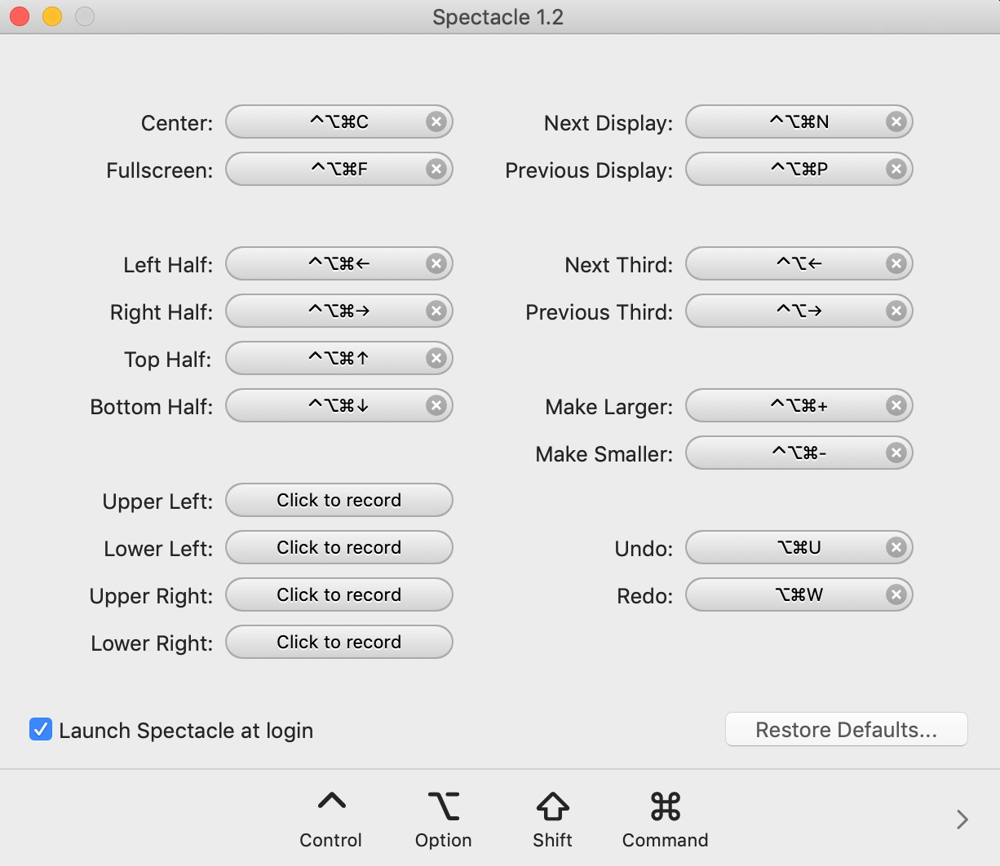
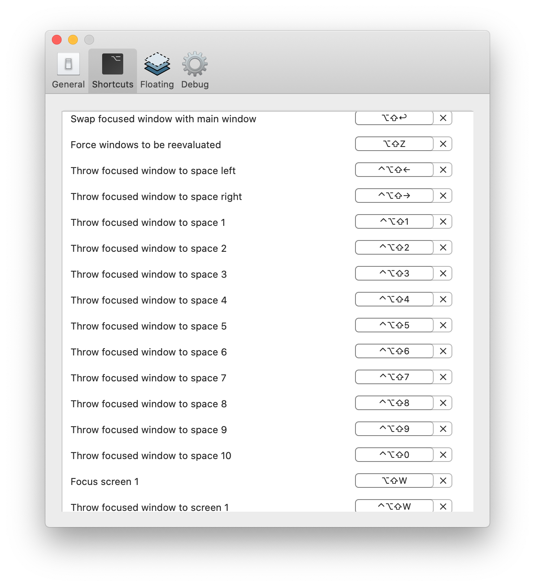

Using a mouse or trackpad is a major distraction and flow-breaker for many development tasks, especially programming.
I strive for using keyboard shortcuts as much as possible to be more productive while programming.

Out of the box, Mac OS X does not provide many keyboard shortcuts when it comes to window management. As an example, it does not allow to throw a focused window to another space.

In this article I want to present my curated list of useful Mac tools to manage windows, displays, and spaces (of [Mission Control](https://en.wikipedia.org/wiki/Mission_Control_(macOS))) without a mouse. I hope you retire your mouse after reading this post.

TODOS
- Screencasts

# Mission Control / Spaces
- zwischen Spaces links/rechts navigieren
- Spaces anzeigen

# Other useful Mac OX Shortcuts
- herunerfahren
- Bildschirm locken
- Fenster beenden
- App beenden
- cmd tab und cmd shift tab
- spotlight
- Screenshot
- Spotlight
- alt cmd ESC

# Alfred
- launcher / spotlight alternative

# Spectacle &ndash; The missing Window Manager

[Spectacle](https://www.spectacleapp.com/) is an awesome tool that allows for changing the size or position of a particular window. It upgrades Mac OS 
in a way that you can use keyboard shortcuts to resize or move focused windows of any app. Sophisticated window management by shortcuts is one aspect I have missed from Microsoft Windows when I was working in a project with PCs as development machines.  In my current project 
I have an environment with two external displays in addition to the built-in display of my Macbook. Spectacle provides 
customizable shortcuts even for throwing a focused window to another display (`Next Display` and `Previous Display`). 

Besides moving windows from one visible display to another, I highly use shortcuts to resize windows like `Make Larger`, `Make Smaller`, or `Left Half`.

I appreciate Spectacle's simplicity. You have a nice glasses icon in the menu bar to see all window actions along with keyboard shortcuts at a glance. To change them just go to the setting dialog. 

The following recording gives an impression how Spectacle works. I used the shortcuts as you can see in the screenshot above.

*TODO* Video mit key captures

# Amethyst

[Amethyst](https://ianyh.com/amethyst/) constitutes a tiling window manager for Mac OS X. It has some features in common with Spectacle, e.g., increasing and decreasing window sizes by shortcuts. However, as you can see from the screenshot about Amethyst's settings, the tool provides many more useful shortcuts.

My personal killer feature is the ability to throw focused windows to a particular space. I very often move a window to the left or right space (`Throw focused window to space left` or `Throw focused window to space right`).

Another very handy feature does not require using shortcuts at all. Amethyst rearranges windows on a display automatically. As an example, if you have a single browser window on your active display and you open another browser window by `Cmd N`, both windows are positioned next to each other with the exact same width and height. If you put another window of any software on this display, all three windows are rearranged again in a way that there is no overlapping. 

Take a look at the screencast to get a better understanding of Amethyst.

*TODO* Video mit key captures

# Contexts

I use [Contexts](https://contexts.co/) primarily for an improved Command-Tab switcher.

Contexts adds the ability to select individual windows by using the learned key combos `cmd tab` and `cmd shift tab` (to move up the list). In the settings you can also define other shortcuts for these actions. Additionally, you can also use multiple shortcuts for invoking the window switcher with individual settings, which is not possible with Mac OS default switcher.

As you can see from the previous screenshot, you can define any number of shortcuts to activate the window switcher and to move the list up and down. What I really like is that you can restrict the list for every shortcut, e.g., only visible spaces.

Another major time safer is Contexts' search capability. Actually, it acts more like a filter of the window list. 

When you have activated the switcher panel, you can just type and thereby filter the list to save moving up and down the list.

.

You can even optimize this workflow by defining a modifier key to activate and use the fast search feature. To switch to a window, press this modifier key and type a few characters from the app name or window title. As you can see from a previous screenshot, on the left-hand side of the switcher panel characters are shown that show you suitable strings for fast search.

TODO: kurzes Video mit aktivierten Tasten

# IDE / Editor
ggf. anteasern von extra blog post

# Build-in Shortcuts

The following Mac OS shortcuts have to be known and used frequently in your daily development work... Cmd W ...