# The `useEffect` Hook explained crystal clear
Understanding how the `useEffect` [Hook works](https://blog.logrocket.com/react-reference-guide-hooks-api/#useeffect) is one of the most important concepts for mastering React today. If you have been working with React for several years, it is especially crucial to understand how working with `useEffect` differs from working with the lifecycle methods of class-based component. In fact, it is a wholesale shift in mindset!

_Originally published at [blog.logrocket.com](https://blog.logrocket.com/guide-to-react-useeffect-hook/)_

Fully understanding effects is a complex issue. As [Dan Abramov of the React team stated](https://overreacted.io/a-complete-guide-to-useeffect/), you might have to unlearn some things to fully grasp effects.

With `useEffect`, you invoke side effects from within functional components, which is an important concept to understand in the React Hooks era. Working with the side effects invoked by the `useEffect` Hook may seem cumbersome at first, but you’ll eventually learn everything makes a lot of sense.

The goal of this comprehensive article is to gather information about the underlying concepts of `useEffect` and, in addition, to provide learnings from my own experience with the `useEffect` Hook.

For example, now that I have dealt with `useEffect` for quite some time, I have realized that it is key to fully understand the component flow of functional components. As such, this aspect is an important topic in this article.

I aim to provide a guide that both newbies and experienced React developers will find valuable and informative. Throughout the article, I provide many code examples to explain crucial concepts. These code snippets are part of my companion [Github project](https://github.com/doppelmutzi/useeffect-showcase).

# A whole new mental model: The core concepts of `useEffect`

First of all, you need to start thinking in effects. 


> “There won’t be much to learn. In fact, we’ll spend most of our time unlearning.”
> 
> – [Dan Abramov](https://overreacted.io/a-complete-guide-to-useeffect/)

What are effects, really? Examples are:


- Fetching data
- Reading from local storage
- Registering and deregistering event listeners

React's effects are a completely different animal than the lifecycle methods of class-based components. The abstraction level differs, too.


> “I’ve found Hooks to be a very powerful abstraction — possibly a little too powerful. As the saying goes, with great power comes great responsibility.”
> 
> – [Bryan Manuele](https://medium.com/@bryanmanuele/react-hooks-best-practices-a-shift-in-mindset-8fd0e58e4b0b)

To their credit, lifecycle methods do give components a predictable structure. The code is more explicit in contrast to effects, so developers can directly spot the relevant parts (e.g., `componentDidMount`) in terms of performing tasks at particular lifecycle phases (e.g., on component unmount).

As we will see later, the `useEffect` Hook fosters separation of concerns and reduces code duplication. For example, the official React docs show that you can [avoid duplicated code of life-cycle methods with one useEffect statement](https://reactjs.org/docs/hooks-effect.html#example-using-classes).

## The key concepts of using effects

Before we continue, we should summarize the main concepts you’ll need to understand to master `useEffect`. Throughout the article, I will highlight the different aspects in great detail.


- You must have a thorough understanding of when components (re-)render because effects run after every render cycle.
- Effects are always executed after render, but you have options to opt out from this behavior.
- To opt out or skip effects, you have to understand basic JavaScript concepts about values. An effect is only rerun if at least one of the values specified as part of the effect's dependencies has changed since the last render cycle.
- You should ensure that components are not re-rendered unnecessarily. This constitutes another strategy to skip unnecessary reruns of effects.
- You have to understand that functions defined in the body of your function component get re-created on every render cycle. This has an impact if you use it inside of your effect. There are strategies to cope with it (hoist them outside of the component, define them inside of the effect, use `useCallback`).
- You have to understand basic JavaScript concepts such as [stale closures](https://dmitripavlutin.com/react-hooks-stale-closures/), otherwise you might have trouble tackling problems with outdated props or state values inside of your effect. There are strategies to solve this, e.g., with an effect's dependency array or with the `useRef` [Hook](https://blog.logrocket.com/react-reference-guide-hooks-api/#useref).
- You should not ignore suggestions form the React Hooks ESLint plugin. Do not blindly remove dependencies or rashly ignore or disable inline comments in ESLint; you most likely have introduced a bug. You may still lack understanding of some important concept.
- Do not mimic the lifecycle methods of class-based components. This way of thinking does more harm than good. Instead, think more in terms of data flow and state associated with effects because you run effects based on state changes across render cycles.

A nice way of thinking about the last bullet point is the following tweet.


> “The question is not ‘when does this effect run,’ the question is ‘with which state does this effect synchronize with?’ “
> 
> – [Ryan Florence](https://twitter.com/ryanflorence/status/1125041041063665666)
## Always use `useEffect` for asynchronous tasks

For your fellow developers, `useEffect` code blocks are clear indicators of asynchronous tasks. Of course, it is possible to write asynchronous code without `useEffect`, but it is not the "React way," and it increases both complexity and the likelihood of introducing errors.

Instead of writing asynchronous code without `useEffect` that might block the UI, utilizing `useEffect` is a known pattern in the React community — especially the way the React team has designed it to execute side effects.

Another advantage of using `useEffect` is that developers can easily [overview the code](https://medium.com/better-programming/understanding-the-useeffect-dependency-array-2913da504c44) and quickly recognize code that is executed "outside the control flow," which becomes relevant only after the first render cycle.

One top of that, `useEffect` blocks are candidates to extract into reusable and even more semantic custom Hooks.

## Use multiple effects to separate concerns

Don't be afraid to use multiple `useEffect` statements in your component. While `useEffect` is designed to handle only one concern, you’ll sometimes need more than one effect.

When you try to use only one effect for multiple purposes, it decreases the readability of your code, and some use cases are straight-up [not realizable](https://stackoverflow.com/a/54004148).

## When are effects executed within the component lifecycle?

First, a reminder: don't think in lifecycle methods anymore! Don't try to mimic these methods! I will go into more detail about the motives later.

This [interactive diagram](https://projects.wojtekmaj.pl/react-lifecycle-methods-diagram/) shows the React phases in which certain lifecycle methods (e.g., `componentDidMount`) are executed.

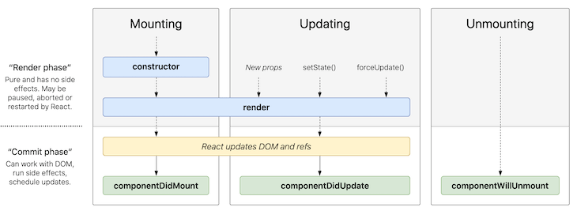


In contrast, the next [diagram](https://wavez.github.io/react-hooks-lifecycle/) shows how things work in the context of functional components. 


This may sound strange at first, but effects defined with `useEffect` are invoked after render. To be more specific, it runs both after the first render and after every update. In contrast to lifecycle methods, [effects don't block the UI](https://reactjs.org/docs/hooks-effect.html#detailed-explanation) because they run asynchronously.

If you are new to React, I would recommend ignoring class-based components and lifecycle methods and instead learn how to develop functional components and how to decipher the powerful possibilities of effects. Class-based components are rarely used in more recent React development projects.

If you are a seasoned React developer and are familiar with class-based components, of course you have to do some of the same things in your projects today as you did two years ago when there were no Hooks.

As an example, it is pretty common to "do something" when the component is first rendered. The difference with Hooks here is subtle: you do not do something after the component is mounted, you do something after the component is first presented to the user. As [others have noted](https://medium.com/better-programming/understanding-the-useeffect-dependency-array-2913da504c44#:~:text=The%20dependency%20array%20is%20the,defined%20in%20the%20first%20argument.), Hooks force you to think more from the user’s perspective.

The whole process may be hard to understand at first, but we'll look at the different parts bit by bit, so you'll have a complete understanding in the end.

## `useEffect`'s control flow at an glance

This section briefly describes the control flow of effects. The following steps are carried out for a functional React component if at least one effect is defined.

1. Based on a state, prop, or context change, the component will be re-rendered.

2. If one or more `useEffect` declarations exist for the component, React checks each `useEffect` to determine whether it fulfills the conditions to execute the implementation (the body of the callback function provided as first argument). In this case, "conditions" mean that one or more dependencies have changed since the last render cycle.

Dependencies are array items provided as the optional second argument of the `useEffect` call. Array values must be from the component scope (i.e., props, state, context, or values derived from the aforementioned).

3. After execution of every effect, scheduling of new effects occurs based on every effect's dependencies. If an effect does not specify a dependency array at all, it means that this effect is executed after every render cycle.

4. Cleanup is an optional step for every effect if the body of the `useEffect` callback function (first argument) returns a so-called "cleanup callback function." In this case, the cleanup function gets invoked before the execution of the effect beginning with the second scheduling cycle. This also means that if there is no second execution of an effect scheduled, the cleanup function is invoked before the React component gets destroyed.

I am quite sure that this lifecycle won’t be entirely clear to you if you have little experience with effects. That's why I explain every single aspect in great detail throughout this article. I encourage you to return to this section later — I'm sure your next read will be totally clear.

# How to execute side effects with `useEffect`

The signature of the `useEffect` Hook looks like this:

```javascript
    useEffect(
        () => {
            // execute side effect
        },
        // optional dependency array
        [
            // 0 or more entries
        ] 
    )
```

Because the second argument is optional, the following execution is perfectly fine:

```javascript
    useEffect(() => { 
        // execute side effect
    })
```

Let's take a look at an example. The user can change the document title with an input field.

```javascript
    import React, { useState, useRef, useEffect } from "react";
    function EffectsDemoNoDependency() {
      const [title, setTitle] = useState("default title");
      const titleRef = useRef();
      useEffect(() => {
        console.log("useEffect");
        document.title = title;
      });
      const handleClick = () => setTitle(titleRef.current.value);
      console.log("render");
      return (
        <div>
          <input ref={titleRef} />
          <button onClick={handleClick}>change title</button>
        </div>
      );
    }
```

The `useEffect` statement is only defined with a single, mandatory argument to implement the actual effect to execute. In our case, we use the state variable representing the title and assign its value to `document.title`. 

Because we skipped the second argument, this `useEffect` is called after every render. Because we implemented an [uncontrolled](https://reactjs.org/docs/uncontrolled-components.html) input field with the help of the `useRef` Hook, `handleClick` is only invoked after the user clicks on the button. This causes a re-render because `setTitle` performs a state change.
 
After every render cycle, `useEffect` is executed again. To demonstrate this, I added two `console.log` statements.


The first two log outputs are due to the initial rendering after the component was mounted. Let's add another state variable to the example to toggle a dark mode with the help of a checkbox.

```javascript
    function EffectsDemoTwoStates() {
      const [title, setTitle] = useState("default title");
      const titleRef = useRef();
      const [darkMode, setDarkMode] = useState(false);
      useEffect(() => {
        console.log("useEffect");
        document.title = title;
      });
      console.log("render");
      const handleClick = () => setTitle(titleRef.current.value);
      const handleCheckboxChange = () => setDarkMode((prev) => !prev);
      return (
        <div className={darkMode ? "dark-mode" : ""}>
          <label htmlFor="darkMode">dark mode</label>
          <input
            name="darkMode"
            type="checkbox"
            checked={darkMode}
            onChange={handleCheckboxChange}
          />
          <input ref={titleRef} />
          <button onClick={handleClick}>change title</button>
        </div>
      );
    }
```

However, this example leads to unnecessary effects when you toggle the `darkMode` state variable.


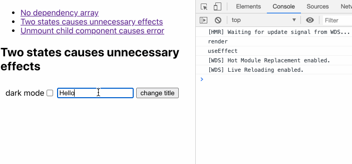


Of course, it’s not a huge deal in this example, but you can imagine more problematic use cases that cause bugs or at least performance issues. Let's take a look at the following code and try to read the initial title from local storage if available in an additional `useEffect` block.

```javascript
    function EffectsDemoInfiniteLoop() {
      const [title, setTitle] = useState("default title");
      const titleRef = useRef();
      useEffect(() => {
        console.log("useEffect title");
        document.title = title;
      });
      useEffect(() => {
        console.log("useEffect local storage");
        const persistedTitle = localStorage.getItem("title");
        setTitle(persistedTitle || []);
      });
      console.log("render");
      const handleClick = () => setTitle(titleRef.current.value);
      return (
        <div>
          <input ref={titleRef} />
          <button onClick={handleClick}>change title</button>
        </div>
      );
    }
```

As you can see, we have an infinite loop of effects because every state change with `setTitle` triggers another effect, which updates the state again.

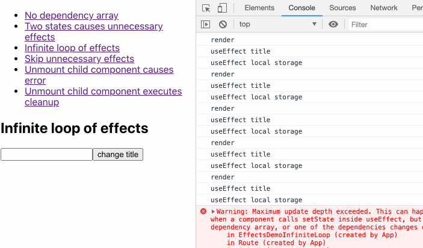

## The importance of the dependency array

Let's get back to our previous example with two states (title and dark mode). Why do we have the problem of unnecessary effects?

Again, if you do not provide a dependency array, every scheduled `useEffect` is executed. This means that after every render cycle, every effect defined in the corresponding component is executed one after the other based on the positioning in the source code.

So the order of your effect definitions matter. In our case, our single `useEffect` statement is executed whenever one of the state variables change.

You have the ability to opt out from this behavior. This is managed with dependencies you provide as array entries. In these cases, React only executes the `useEffect` statement if at least one of the provided dependencies has changed since the previous run. In other words, with the dependency array, you make the execution dependent on certain conditions.

More often than not, this is what we want; we usually want to execute side effects after specific conditions, e.g., data changed, a prop changed, or the user first sees our component. Another strategy to skip unnecessary effects is to prevent unnecessary re-renders in the first place with, e.g., `React.memo`, as we see later.

Back to our example where we want to skip unnecessary effects after an intended re-render, we just have to add and array with `title` as a dependency. With that, the effect is only executed when the values between render cycles differ.

```javascript
      useEffect(() => {
        console.log("useEffect");
        document.title = title;
      }, [title]);
```

Here’s the complete code snippet:

```javascript
    function EffectsDemoTwoStatesWithDependeny() {
      const [title, setTitle] = useState("default title");
      const titleRef = useRef();
      const [darkMode, setDarkMode] = useState(false);
      useEffect(() => {
        console.log("useEffect");
        document.title = title;
      }, [title]);
      console.log("render");
      const handleClick = () => setTitle(titleRef.current.value);
      const handleCheckboxChange = () => setDarkMode((prev) => !prev);
      return (
        <div className={darkMode ? "view dark-mode" : "view"}>
          <label htmlFor="darkMode">dark mode</label>
          <input
            name="darkMode"
            type="checkbox"
            checked={darkMode}
            onChange={handleCheckboxChange}
          />
          <input ref={titleRef} />
          <button onClick={handleClick}>change title</button>
        </div>
      );
    }
```

As you can see in the recording, effects are only invoked as expected on pressing the button.


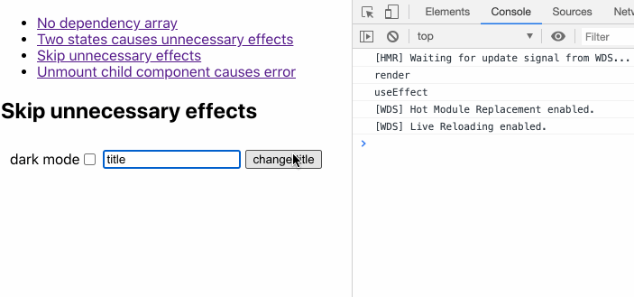


It is also possible to add an empty dependency array. In this case, effects are only executed once; it is similar to the [componentDidMount()](https://reactjs.org/docs/react-component.html#componentdidmount) lifecycle method. To demonstrate this, let's take a look at the previous example with the infinite loop of effects..

```javascript
    function EffectsDemoEffectOnce() {
      const [title, setTitle] = useState("default title");
      const titleRef = useRef();
      useEffect(() => {
        console.log("useEffect title");
        document.title = title;
      });
      useEffect(() => {
        console.log("useEffect local storage");
        const persistedTitle = localStorage.getItem("title");
        setTitle(persistedTitle || []);
      }, []);
      console.log("render");
      const handleClick = () => setTitle(titleRef.current.value);
      return (
        <div>
          <input ref={titleRef} />
          <button onClick={handleClick}>change title</button>
        </div>
      );
    }
```

We just added an empty array as our second argument. Because of this, the effect is only executed once after the first render and skipped for the following render cycles.


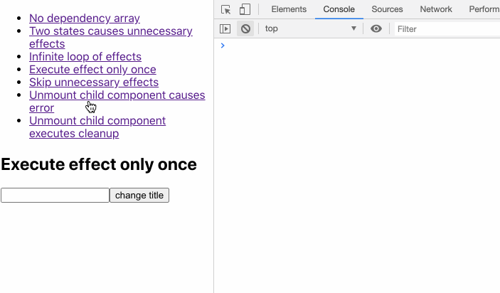


If you think about it, this behavior makes sense. In principle, the dependency array says, “Execute the effect provided by the first argument after the next render cycle whenever one of the arguments changes.” However, we do not have any argument, so dependencies will never change in the future.

That's why using an empty dependency array makes React invoke an effect only once — after the first render. The second render along with the second `useEffect title` is due to the state change invoked by `setTitle()` after we read the value from local storage.

## Rules of Hooks

Before we continue with more examples, we have to talk about the general rules of Hooks. These are not exclusive to the `useEffect` Hook, but it's important to understand at which places in your code you can define effects. You need to follow [rules to use Hooks](https://reactjs.org/docs/hooks-rules.html):

1. Hooks can only be invoked from the top-level function constituting your functional React component.
2. Hooks may not be called from nested code (e.g., loops, conditions, or another function body).
3. However, custom Hooks are special functions, and Hooks may be called from the top-level function of the custom Hook. In addition, rule two is also true.

## How the React Hooks ESLint plugin promotes understanding of the rules of Hooks

There’s a handy [ESLint plugin](https://www.npmjs.com/package/eslint-plugin-react-hooks) that assists you in following the rules of Hooks. It lets you know if you violate one of the rules.


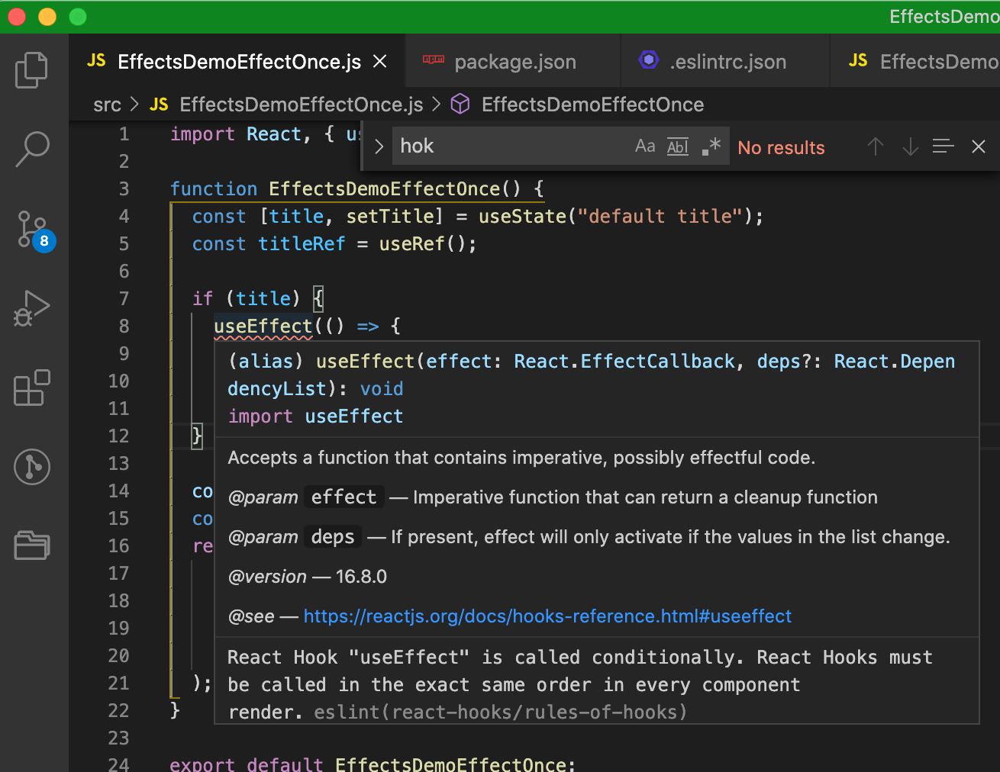


In addition, it helps you to provide a correct dependency array for effects in order to prevent bugs. 


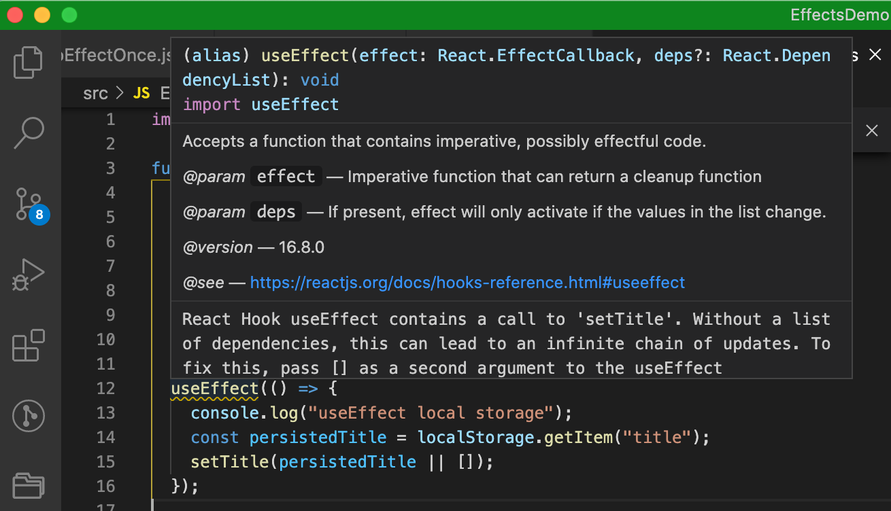


This plugin is great because, in practice, you might miss the opportunity to add dependencies to the list; this is not always obvious at first. Besides, careless mistakes can happen at any time. I like the plugin because its messages foster learning more about how effects work.

If you don’t understand why the plugin wants you to add a certain dependency, please don’t prematurely ignore it! You should at least have a very good explanation for doing it. I have recently discovered that, in some circumstances, you most likely will have a bug if you omit the dependency.

```javascript
    useEffect(() => {
        // ...
        // eslint-disable-next-line react-hooks/exhaustive-deps
      }, []);
```

Finally, be aware that the plugin is not omniscient. You have to accept that the ESLint plugin — even though it’s awesome — cannot understand the runtime behavior of your code. It can only apply static code analysis. There are certainly cases where the plugin cannot assist you.

However, I have no arguments against integrating the plugin into your project setup. It reduces error-proneness and increases robustness. In addition, take a closer look at the provided suggestions: they might enable new insights into concepts you haven't grasped completely. It is worth Googling the message to learn more about the background in discussions.

With all that said, you shouldn’t be so dogmatic as to satisfy the plugin all the time. Check out the setup in the [companion project](https://github.com/doppelmutzi/useeffect-showcase) for this article.

## What are legitimate dependency array items?

This brings us to an important question: What items should be included in the dependency array? According to the [React Docs](https://reactjs.org/docs/hooks-effect.html#tip-optimizing-performance-by-skipping-effects), you have to include all values from the component scope that change their values between re-renders. 

What does this mean, exactly? All external values referenced inside of the `useEffect` callback function, such as props, state variables, or context variables, are dependencies of the effect. Ref containers (i.e., what you directly get from `useRef()` and not the `current` property) are also [valid dependencies](https://github.com/facebook/react/issues/16121#issuecomment-511369830). Even [local variables](https://reactjs.org/docs/hooks-faq.html#is-it-safe-to-omit-functions-from-the-list-of-dependencies), which are derived from the aforementioned values, have to be listed in the dependency array.

It is essential to understand the conceptual thinking of effects; the React team wants you to treat every value [used inside of the effect](https://github.com/facebook/react/issues/14920#issuecomment-471070149) as dynamic. So even if you use a non-function value inside the effect, and you are pretty sure this value is unlikely to change, you should include the value in the dependency array.

That’s because, however unlikely it may be, there is still a chance the value will change. Who knows whether the component will get refactored? Suddenly, the value is no longer constant in every case, and you might have introduced a potential stale prop/state/context bug.

Therefore, make sure to add every value from the component scope to the list of dependencies because you should treat every value as mutable. Remember that if at least one of the dependencies in the array is different from the previous render, the effect will be rerun.

## Utilizing cleanup functions

The next snippet shows an example to demonstrate a problematic issue.

```javascript
    function Counter() {
      const [count, setCount] = useState(0);
      useEffect(() => {
        const interval = setInterval(function () {
          setCount((prev) => prev + 1);
        }, 1000);
      }, []);
      return <p>and the counter counts {count}</p>;
    }
    function EffectsDemoUnmount() {
      const [unmount, setUnmount] = useState(false);
      const renderDemo = () => !unmount && <Counter />;
      return (
        <div>
          <button onClick={() => setUnmount(true)}>Unmount child component</button>
          {renderDemo()}
        </div>
      );
    }
```

This code implements a React component representing a counter that increases a number every second. The parent component renders the counter and allows you to destroy the counter by clicking on a button. Take a look at the recording to see what happens when a user clicks on that button.


The child component has registered an interval that invokes a function every second. However, the component was destroyed without unregistering the interval. After the component is destroyed, the interval is still active and wants to update the component's state variable (`count`), which no longer exists.

The solution is to unregister the interval right before unmount. This is possible with a cleanup function. Therefore, you have to return a callback function inside the effect's callback body.

```javascript
    useEffect(() => {
        const interval = setInterval(function () {
          setCount((prev) => prev + 1);
        }, 1000);
        // return optional function for cleanup
        // in this case acts like componentWillUnmount
        return () => clearInterval(interval);
    }, []);
```

I want to emphasize that cleanup functions are not only invoked before destroying the React component. An effect's cleanup function gets invoked every time, right before the execution of the next scheduled effect. 

Let's take a closer look at our example. We used a trick to have an empty dependency array in the first place, so the cleanup function acts like a `componentWillUnmount()` lifecycle method. If we do not call `setCount` with a callback function that gets the previous value as an argument, we need to come up with the following code, wherein we add `count` to the dependencies array.

```javascript
    useEffect(() => {
        console.log("useEffect")
        const interval = setInterval(function () {
            setCount(count + 1);
        }, 1000);
        // return optional function for cleanup
        // in this case, this cleanup fn is called every time count changes
        return () => {
            console.log("cleanup");
            clearInterval(interval);
        }
    }, [count]);
```


In comparison, the former example executes the cleanup function only once — on mount — because we prevented the use of the state variable (`count`) directly. 

```javascript
    useEffect(() => {
        console.log("useEffect")
        const interval = setInterval(function () {
            setCount(prev => prev + 1);
        }, 1000);
        // return optional function for cleanup
        // in this case, this cleanup fn is called every time count changes
        return () => {
            console.log("cleanup");
            clearInterval(interval);
        }
    }, []);
```

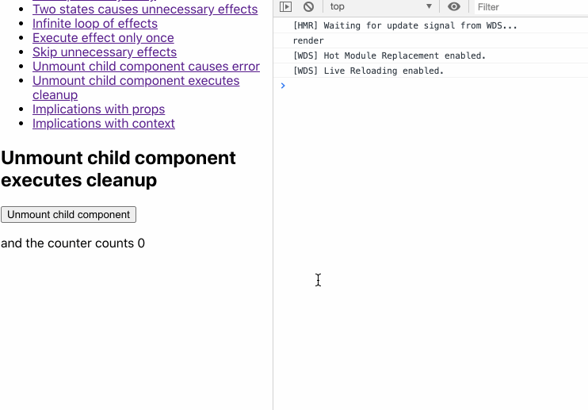


In this context, the latter approach is a tiny performance optimization because we reduce the number of cleanup function calls.

I hope these example have convinced you that working with effects is different from lifecycle methods and that it is ultimately not beneficial to try to mimic these methods.

## Implications of prop and state changes

There is a natural correlation between prop changes and the execution of effects because they cause re-renders, and as we already know, effects are scheduled after every render cycle.

Consider the following example. The plan is that the `Counter` component's interval can be configured by a prop with the same name.

```javascript
    function Counter({ interval }) {
      const [count, setCount] = useState(0);
      useEffect(() => {
        const counterInterval = setInterval(function () {
          setCount((prev) => prev + 1);
        }, interval);
        return () => clearInterval(counterInterval);
      }, []);
      return <p>and the counter counts {count}</p>;
    }
    function EffectsDemoProps() {
      const [interval, setInterval] = useState(1000);
      return (
        <div>
          <input
            type="text"
            value={interval}
            onChange={(evt) => setInterval(evt.target.value)}
          />
          <Counter interval={interval} />
        </div>
      );
    }
```

The handy ESLint plugin points out that we are missing something important: because we haven't added the  `interval` prop to the dependency array (having instead defined an empty array), the change to the input field in the parent component is without effect. The initial value of `1000` is used even after we adjust the value of the input field.


Instead, we have to add the prop to the dependency array.

```javascript
    useEffect(() => {
        const counterInterval = setInterval(function () {
          setCount((prev) => prev + 1);
        }, interval);
        return () => clearInterval(counterInterval);
      }, [interval]);
```

Now things look much better.


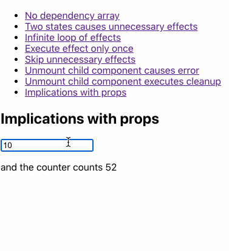

## More on prop changes, and the `useCallback` Hook

Let's extend the example a bit to demonstrate more pivotal concepts in conjunction with prop changes.

```javascript
    const Counter = ({ interval, onDarkModeChange }) => {
      console.log("render Counter");
      const [count, setCount] = useState(0);
      useEffect(() => {
        console.log(`useEffect ${onDarkModeChange()}`);
        const counterInterval = setInterval(function () {
          setCount((prev) => prev + 1);
        }, interval);
        return () => clearInterval(counterInterval);
      }, [interval, onDarkModeChange]);
      return <p>and the counter counts {count}</p>;
    };
    const IntervalConfig = ({ onDarkModeChange }) => {
      console.log("render IntervalConfig");
      const [interval, setInterval] = useState(1000);
      const onChange = (evt) => setInterval(evt.target.value);
      return (
        <div>
          <input type="text" value={interval} onChange={onChange} />
          <Counter interval={interval} onDarkModeChange={onDarkModeChange} />
        </div>
      );
    };
    const EffectsDemoProps = () => {
      console.log("render EffectsDemoProps");
      const [numberClicks, setNumberClicks] = useState(0);
      const [darkMode, setDarkMode] = useState(false);
      const onDarkModeChange = () => (darkMode ? "🌙" : "🌞");
      return (
        <div
          style={
            darkMode
              ? { backgroundColor: "black", color: "white" }
              : { backgroundColor: "white", color: "black" }
          }
        >
          <label htmlFor="darkMode">dark mode</label>
          <input
            name="darkMode"
            type="checkbox"
            checked={darkMode}
            onChange={() => setDarkMode((prev) => !prev)}
          />
          <p>
            <button onClick={() => setNumberClicks((prev) => prev + 1)}>
              click
            </button>
            <span>&nbsp;Number clicks: {numberClicks}</span>
          </p>
          <IntervalConfig onDarkModeChange={onDarkModeChange} />
        </div>
      );
    };
```

I added log statements to indicate all component renderings, as well as the invocation of our `useEffect` statement. Let's take a look at what happens.


So far, so good — we can toggle the dark mode checkbox, and the effect should be executed, too. The callback function `onDarkModeChange` to be executed is passed down the component tree to the `Counter` component. We added it to the dependency array of the `useEffect` statement as suggested by the ESLint plugin.

```javascript
    useEffect(() => {
        console.log(`useEffect ${onDarkModeChange()}`);
        const counterInterval = setInterval(function () {
          setCount((prev) => prev + 1);
        }, interval);
        return () => clearInterval(counterInterval);
      }, [interval, onDarkModeChange]);
```

As you can see from the recording, the effect is executed if one of the two props (`interval` or  `onDarkModeChange`) changes.

All good? Not so fast. As you can see from the next recording, if we click on the button, the effect is mistakenly executed.

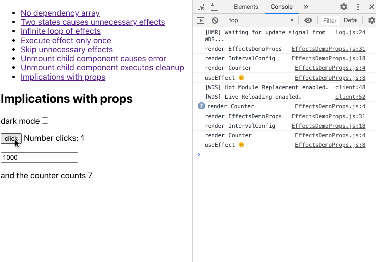


Sure, the state of the `EffectsDemoProps` changes, and this component is rendered along with its child components. The solution is to use [React.memo](https://reactjs.org/docs/react-api.html#reactmemo), right? 

```javascript
    const Counter = React.memo(({ interval, onDarkModeChange }) => {
        // ...
    });
    const IntervalConfig = React.memo(({ onDarkModeChange }) => {
        // ...
    });
```

Well, the components are still rendered, and the effect is still mistakenly executed.

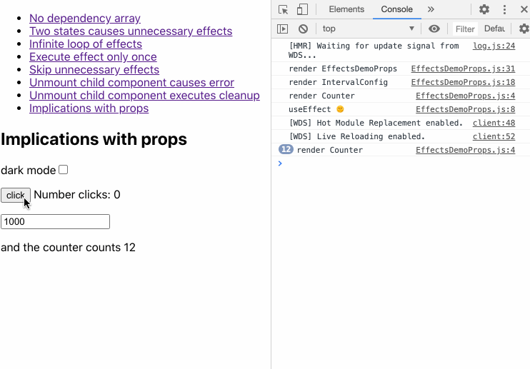


Why is our `Counter` component's effect executed? The problem lies in the `onDarkModeChange` function.

```javascript
    const EffectsDemoProps = () => {
        // ...
        const onDarkModeChange = () => (darkMode ? "🌙" : "🌞");
        // ...
    };
```

On button click, the `numberClicks` state of the `EffectsDemoProps` component gets changed, and the component is thus re-rendered.

This is because `onDarkModeChange` is defined inline of the component and gets recreated every time the component re-renders. So even if you use `React.memo` on the child components, they get re-rendered because the passed `onDarkModeChange` function prop points to another reference every time.

This is why it is crucial to understand the identity of values. In contrast to recreated primitive values like numbers, a recreated function points to another "cell" in memory. That's why the function values differ.

We can fix this with the [useCallback](https://blog.logrocket.com/react-reference-guide-hooks-api/#usecallback) Hook. In addition, we do not necessarily need to use `React.memo` because it’s not really a problem to get the child components re-rendered in our example. However, we want to execute the effect only when the `interval` value or the `darkMode` value changes.

```javascript
    import React, { useState, useEffect, useCallback } from "react";
    const Counter = ({ interval, onDarkModeChange }) => {
        // ...
    };
    const IntervalConfig = ({ onDarkModeChange }) => {
        // ...
    };
    const EffectsDemoProps = () => {
        // ..
        const onDarkModeChange = useCallback(() => {
            return darkMode ? "🌙" : "🌞";
        }, [darkMode]);
        // ...
    };
```

With `useCallback`, React only creates a new function whenever one of the dependencies changes — in our case, the `darkMode` state variable. With this in place, our example works as expected.


## `useCallback` with `useContext`

If we modify the example and use React Context with the [useContext](https://blog.logrocket.com/react-reference-guide-hooks-api/#usecontext) Hook instead of passing down props to the child components, we still need to use `useCallback` for the `onDarkModeChange` dependency. The reasons are the same as in the previous section.

```javascript
    import React, { useState, useEffect, useCallback, useContext } from "react";
    const EffectsContext = React.createContext(null);
    const Counter = ({ interval }) => {
      const [count, setCount] = useState(0);
      const { onDarkModeChange } = useContext(EffectsContext);
      useEffect(() => {
        const counterInterval = setInterval(function () {
          setCount((prev) => prev + 1);
        }, interval);
        return () => clearInterval(counterInterval);
      }, [interval, onDarkModeChange]);
      return <p>and the counter counts {count}</p>;
    };
    const IntervalConfig = () => {
      const [interval, setInterval] = useState(1000);
      const onChange = (evt) => setInterval(evt.target.value);
      return (
        <div>
          <input type="text" value={interval} onChange={onChange} />
          <Counter interval={interval} />
        </div>
      );
    };
    const EffectsDemoContext = () => {
      const [numberClicks, setNumberClicks] = useState(0);
      const [darkMode, setDarkMode] = useState(false);
      const onDarkModeChange = useCallback(() => {
        return darkMode ? "🌙" : "🌞";
      }, [darkMode]);
      return (
        <div
          style={
            darkMode
              ? { backgroundColor: "black", color: "white" }
              : { backgroundColor: "white", color: "black" }
          }
        >
          <label htmlFor="darkMode">dark mode</label>
          <input
            name="darkMode"
            type="checkbox"
            checked={darkMode}
            onChange={() => setDarkMode((prev) => !prev)}
          />
          <p>
            <button onClick={() => setNumberClicks((prev) => prev + 1)}>
              click
            </button>
            <span>&nbsp;Number clicks: {numberClicks}</span>
          </p>
          <EffectsContext.Provider value={{ onDarkModeChange }}>
            <IntervalConfig />
          </EffectsContext.Provider>
        </div>
      );
    };
```

## `useEffect` inside of custom Hooks

[Custom hooks](https://reactjs.org/docs/hooks-custom.html) are awesome because they lead to various benefits:


- Reusable code
- Smaller components because of outsourced code (effects)
- More semantic code due to the function calls of the custom Hooks inside of components
- Effects can be tested when used inside of custom Hooks, as we’ll see in the next section

The following example represents a custom Hook for fetching data. We moved the `useEffect` code block into a function representing the custom Hook. Note that this is a rather simplified implementation that might not cover all your project’s requirements. You can find more production-ready custom fetch Hooks [here](https://github.com/rehooks/awesome-react-hooks).

```javascript
    const useFetch = (url, initialValue) => {
      const [data, setData] = useState(initialValue);
      const [loading, setLoading] = useState(true);
      useEffect(() => {
        const fetchData = async function () {
          try {
            setLoading(true);
            const response = await axios.get(url);
            if (response.status === 200) {
              setData(response.data);
            }
          } catch (error) {
            throw error;
          } finally {
            setLoading(false);
          }
        };
        fetchData();
      }, [url]);
      return { loading, data };
    };
    function EffectsDemoCustomHook() {
      const { loading, data } = useFetch(
        "https://jsonplaceholder.typicode.com/posts/"
      );
      return (
        <div className="App">
          {loading && <div className="loader" />}
          {data?.length > 0 &&
            data.map((blog) => <p key={blog.id}>{blog.title}</p>)}
        </div>
      );
    }
```

The first statement within our React component, `EffectsDemoCustomHook`, uses the custom Hook called `useFetch`. As you can see, using a custom Hook like this is more semantic then using an effect directly inside of the component.

Business logic is nicely abstracted out of the component. We just have to use our custom Hook’s nice API that returns the state variables `loading` and `data`.

The effect inside of the custom Hook is dependent on the scope variable `url` that is passed to the Hook as a prop. This is because we have to include it in the dependency array. So even though we don’t foresee the URL changing in this example, it’s still good practice to define it as a dependency. As mentioned above, there is a chance that the value will change at runtime in the future.

## Additional thoughts on functions used inside of effects

If you take a closer look at the last example, we defined the function `fetchData` inside the effect because we only use it there. This is a best practice for such a use case. If we define it outside the effect, we need to come up with unnecessarily complex code.

```javascript
    const useFetch = (url, initialValue) => {
      const [data, setData] = useState(initialValue);
      const [loading, setLoading] = useState(true);
      const fetchData = useCallback(async () => {
        try {
          setLoading(true);
          const response = await axios.get(url);
          if (response.status === 200) {
            setData(response.data);
          }
        } catch (error) {
          throw error;
        } finally {
          setLoading(false);
        }
      }, [url]);
      useEffect(() => {
        fetchData();
      }, [fetchData]);
      return { loading, data };
    };
```

As you can see, we need to add `fetchData` to the dependency array of our effect. In addition, we need to wrap the actual function body of `fetchData` with `useCallback` with its own dependency (`url`) because the function gets recreated on every render. The whole hullabaloo is unnecessary.  

Dan Abramov has [more recommendations](https://overreacted.io/a-complete-guide-to-useeffect/) for working with functions when used with effects:


- Hoist functions that don’t need any value of the component scope outside of your component
- Move functions that use values of the component scope that are used only by an effect inside of that effect. This is what we did with our custom Hook
- If after that your effect still ends up using functions defined outside of the effect within the component, wrap them into `useCallback` statements where they are defined. This is case of our last example. 

By the way, if you move function definitions into effects, you produce more readable code because it is directly apparent which scope values are used by the effect. The code is even more robust. 

Furthermore, if you do not pass dependencies into the component as props or context, the ESLint plugin "sees" all relevant dependencies and can suggest forgotten values to be declared.

## How to use async functions inside of `useEffect`

If you recall our `useEffect` block inside of the `useFetch` custom Hook, you might ask why we need this extra `fetchData` function definition. Can't we refactor our code like so?

```javascript
    useEffect(async () => {
      try {
        setLoading(true);
        const response = await axios.get(url);
        if (response.status === 200) {
          setData(response.data);
        }
      } catch (error) {
        throw error;
      } finally {
        setLoading(false);
      }
    }, [url]);
```

I'm glad you asked, but no! The following error occurs.

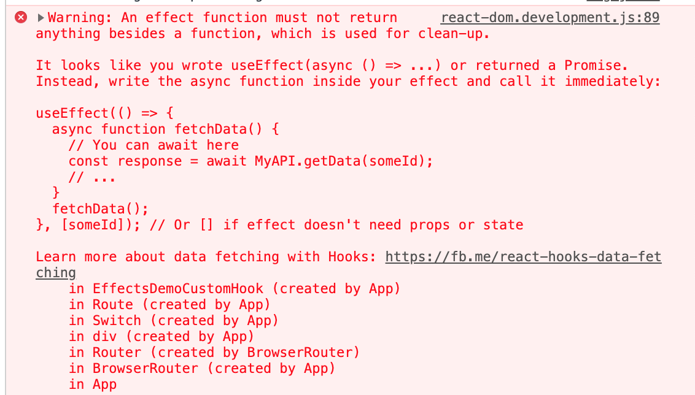


The mighty ESLint plugin also warns you about it.

The reason is that this code returns a promise, but an effect can only return void or a cleanup function. If you want to understand the issue in extreme detail, you can find out [here](https://medium.com/javascript-in-plain-english/how-to-use-async-function-in-react-hook-useeffect-typescript-js-6204a788a435#:~:text=To%20do%20this%2C%20the%20function,instead%20of%20a%20cleanup%20function.&text=This%20pattern%20is%20also%20not,not%20waiting%20for%20a%20promise).

## Unit testing of effects

Extracting `useEffect` blocks into custom Hooks allows for unit testing them because you don’t have to deal with the actual React component. This is a major benefit.

Some time ago, [I wrote an article about unit testing custom hooks](https://dev.to/doppelmutzi/testing-of-a-custom-react-hook-for-fetching-data-with-axios-4gf1) with [React Hooks Testing Library](https://react-hooks-testing-library.com/). This is one possibility to test effects.

The following snippet is a [Jest](https://jestjs.io/) example that tests data fetching even with changing one of the effect's dependencies (`url`) during runtime. 

```javascript
    import { renderHook } from "@testing-library/react-hooks";
    import axios from "axios";
    import MockAdapter from "axios-mock-adapter";
    // import custom hook - in this example extracted to a separate file
    import useFetch from "./useFetch";
    test("useFetch performs multiple GET requests for different URLs", async () => {
      // fetch 1
      const initialValue = "initial value";
      const mock = new MockAdapter(axios);
      const mockData = 1;
      const url = "http://mock";
      mock.onGet(url).reply(200, mockData);
      const { result, waitForNextUpdate } = renderHook(() =>
        useFetch(url, initialValue)
      );
      expect(result.current.data).toEqual("initial value");
      expect(result.current.loading).toBeTruthy();
      await waitForNextUpdate();
      expect(result.current.data).toEqual(1);
      expect(result.current.loading).toBeFalsy();
      // fetch 2
      const url2 = "http://mock2";
      const mockData2 = 2;
      mock.onGet(url2).reply(200, mockData2);
      const initialValue2 = "initial value 2";
      const { result: result2, waitForNextUpdate: waitForNextUpdate2 } = renderHook(
        () => useFetch(url2, initialValue2)
      );
      expect(result2.current.data).toEqual("initial value 2");
      expect(result2.current.loading).toBeTruthy();
      await waitForNextUpdate2();
      expect(result2.current.data).toEqual(2);
      expect(result2.current.loading).toBeFalsy();
    });
```

`useFetch` is wrapped in a [renderHook](https://react-hooks-testing-library.com/usage/basic-hooks#rendering) function call. This provides the correct context to execute the custom Hook without violating the rules of Hooks.

To perform the actual network call, we utilize [waitForNextUpdate](https://react-hooks-testing-library.com/reference/api#waitfornextupdate). This allows us to wait for the asynchronous function to return in order to check the response from the network call. With this set, we can assert the result of our Hook. In our test, we mocked the actual network call with [AxiosMockAdapter](https://github.com/ctimmerm/axios-mock-adapter).

You can also find this code in a [CodeSandbox](https://codesandbox.io/s/testing-custom-hook-demo-ko6bq).

# Some more `useEffect` receipts

In this section, I’ll show you some handy patterns that might be useful.

## Execute an effect only once when a certain condition is met

As we already know, you control the execution of effects mainly with the dependency array. Every time one of the dependencies has changed, the effect is executed. Mostly, you should design your components to execute effects whenever a state changes, not just once.

Sometimes, however, you want to do exactly this — e.g., when a certain event has occurred. You can do this with flags that you use within an `if` statement inside of your effect. The `useRef` Hook is a good choice if you don't want to add an extra render (which would be problematic most of the time) when updating the flag. In addition, you do not have to add the ref to the dependency array.

The following example calls the function `trackInfo` from our effect only if the following conditions are met:


- The user clicked the button at least once
- The user has ticked the checkbox to allow tracking

After the checkbox is checked, the tracking function should only be executed after the user clicks once again on the button.

```javascript
    function EffectsDemoEffectConditional() {
      const [count, setCount] = useState(0);
      const [trackChecked, setTrackChecked] = useState(false);
      const shouldTrackRef = useRef(false);
      const infoTrackedRef = useRef(false);
      const trackInfo = (info) => console.log(info);
      useEffect(() => {
        console.log("useEffect");
        if (shouldTrackRef.current && !infoTrackedRef.current) {
          trackInfo("user found the button component");
          infoTrackedRef.current = true;
        }
      }, [count]);
      console.log("render");
      const handleClick = () => setCount((prev) => prev + 1);
      const handleCheckboxChange = () => {
        setTrackChecked((prev) => {
          shouldTrackRef.current = !prev;
          return !prev;
        });
      };
      return (
        <div>
          <p>
            <label htmlFor="tracking">Declaration of consent for tracking</label>
            <input
              name="tracking"
              type="checkbox"
              checked={trackChecked}
              onChange={handleCheckboxChange}
            />
          </p>
          <p>
            <button onClick={handleClick}>click me</button>
          </p>
          <p>User clicked {count} times</p>
        </div>
      );
    }
```

In this implementation, we utilized two refs: `shouldTrackRef` and `infoTrackedRef`. The latter is the "gate" to guarantee that the tracking function is only invoked once after the other conditions are met.

The effect is rerun every time `count` changes, i.e., whenever the user clicks on the button. Our `if` statement checks the conditions and executes the actual business logic only if it evaluates to `true`.


The log message `user found the button component` is only printed once after the right conditions are met.

## Access data from previous render

If you need to access some data from the previous render cycle, you can leverage a combination of `useEffect` and `useRef`.

```javascript
    function EffectsDemoEffectPrevData() {
      const [count, setCount] = useState(0);
      const prevCountRef = useRef();
      useEffect(() => {
        console.log("useEffect", `state ${count}`, `ref ${prevCountRef.current}`);
        prevCountRef.current = count;
      }, [count]);
      const handleClick = () => setCount((prev) => prev + 1);
      console.log("render");
      return (
        <div>
          <p>
            <button onClick={handleClick}>click me</button>
          </p>
          <p>
            User clicked {count} times; previous value was {prevCountRef.current}
          </p>
        </div>
      );
    }
```

We synchronize our effect with the state variable `count` so that it is executed after the user clicks on the button. Inside of our effect, we assign the current value of the state variable to the mutable `current` property of `prevCountRef`. We output both values in the JSX section.


On loading this demo, on initial render, the state variable has the initial value of the `useState` call. The ref value is `undefined`. It demonstrates once more that effects are run after render. When the user clicks, it works as expected.

# Conclusion

In my opinion, understanding the underlying design concepts and best practices of the `useEffect` Hook is a key skill to master to become a next-level React developer.

If you started your React journey before early 2019, then you have to unlearn your instinct to think in lifecycle methods and instead think in effects.

By adopting the mental model of effects, you’ll get familiar with the component lifecycle, data flow, other Hooks (`useState`, `useRef`, `useContext`, `useCallback`, etc.), and even other optimizations like `React.memo`.