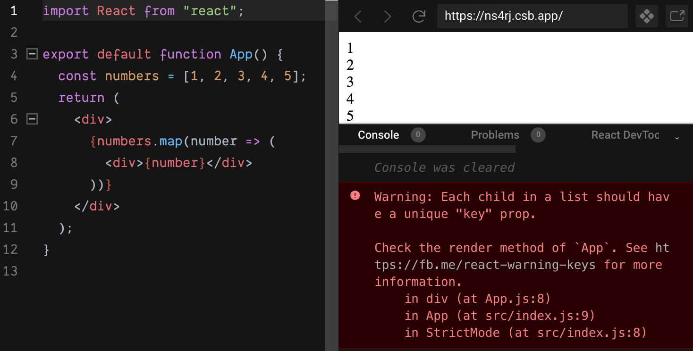

Lists are ubiquitous in applications. In real-life projects, such lists can get very long and, thus, performance-heavy. That's why React wants you to add unique keys to every element whenever you iterate over a list of objects to render multiple JSX elements.

This is crucial — otherwise, React does not know for sure which elements have been added, removed, or reordered compared to the last render cycle. The consequence is that elements are unnecessarily re-rendered or, in the worst case, component states are mixed up and serious bugs occur.

_Originally published at [blog.logrocket.com](https://blog.logrocket.com/unfavorable-react-keys-unpredictable-behavior/)_

So, React needs a little help from us developers to ensure good performance results. If you omit keys, items do not get stable identities within the list, and React will yell at you in the console: **Warning: Each child in a list should have a unique "key" prop**.



## What's the deal with React keys?

The following code block demonstrates how you can provide keys for list elements.

```javascript
function App() {
  const numbers = [1, 2, 3, 4, 5];
  return (
    <div>
      {numbers.map(number => (
        <div key={number}>{number}</div>
      ))}
    </div>
  );
}
```

In this very simple example, we use the item as key as well. Problem solved! However, most of the time you do not have a list with primitive values. What happens if you use an object as key?

```javascript
const numbers = [{val: 1}, {val: 2}, {val: 3}];
  return (
    <div>
      {numbers.map(number => (
        <div key={number}>{number.val}</div>
      ))}
    </div>
  );
```

Well, React throws a warning again.


Take a closer look at the explanation and you’ll notice that the problem is due to the fact that the key value is always transformed into its string representation. Regardless of the actual value, the key value is always `[object Object]`. That's why you have duplicates.

So, the solution is to use a primitive value again.

```javascript
const numbers = [{val: 1}, {val: 2}, {val: 3}];
  return (
    <div>
      {numbers.map(number => (
        <div key={number.val}>{number.val}</div>
      ))}
    </div>
  );
```

In real-world projects, you have code like this and use a property of the list items.

```javascript
const products = fetchProducts();
  return (
    <div>
      {procuts.map(product => (
        <Product key={product.id} product={product} />
      ))}
    </div>
  );
```

You have to choose a property that exists for every list item. In addition, the property value has to be unique, otherwise you get a warning due to duplicates, as you can see above with the `[object Object]` warning.

By the way, you do not have to come up with "human-readable" keys, like in the following example.

```javascript
const numbers = [{val: 1}, {val: 2}, {val: 3}];
  return (
    <div>
      {numbers.map(number => (
        <div key={`number_${number.val}`}>{number.val}</div>
      ))}
    </div>
  );
```

React doesn't care about the key value as long as it meets the requirements for a suitable key. It's really important to provide unique keys, otherwise React's [reconciliation algorithm](https://reactjs.org/docs/reconciliation.html) cannot clearly determine whether something in the list has changed (add, remove, reorder) since the last render cycle.

If you cannot choose one property of a list item to guarantee explicitness, maybe you can combine two or more properties. Take a look at the following constructed example.

```javascript
 const orders = [{user: "Fred", productId: 1}, {user: "Michael", productId: 1}, {user: "Fred", productId: 3}];
  return (
    <div>
      {orders.map(order => (
        <div key={`${order.user}{${order.productId}}`}>User {order.user} ordered product with id {order.productId}</div>
      ))}
    </div>
  );
```

In the next section, we will go into detail about what makes good keys and what can go wrong with unfavorably chosen keys.

## Examples of unsuitable keys and their impact

To demonstrate different use cases, I developed a little [soundboard demo application](https://github.com/doppelmutzi/react-soundboard-key-showcase). In the initialization phase, the app fetches a list of sound objects that gets rendered. Clicking on a list entry plays the corresponding sound. The user can also use the playback buttons to stop playback or play the previous or next sound. You can also filter the list.

Take a look at the dropdown field where you can choose between different variants of how keys are calculated. First, we chose **unique (id)** to use unique IDs as part of the server response. The following animated gif shows the expected behavior. When you click on a list item, the sound effect corresponding to the Label will be played. It works for the unfiltered and filtered list.


You can trace this correct behavior with the console output on the right side; the correct mp3 file is played. For proof that the correct sound effect is actually played, try out the demo app.

However, if you do not use a unique and stable key, strange behavior might occur. To demonstrate this, we select **unstable (index)** from the dropdown.


As you can see in console output, when you play sounds from the unfiltered list, then filter the list and try to play a song for the second time, you end up with the wrong playback. Why does this happen? Because the key of a list item is not stable due to the change of list items. So, without an accurate key, you might end up with serious and hard-to-trace bugs.

This example project showcases why you should always select a stable and unique key. It brings us to the question of what constitutes a stable and unique key?

In this context, stable means that every list item gets the same key every time React goes through the render process. From a coding standpoint, it means that you base your key on the actual data associated with the current list item. Do not derive the key from other contextual information, such as state variables or props of the corresponding React component.

The next code snippet is problematic because the key distribution is not deterministic.

```javascript
const Songs = ({darkMode, mp3s}) => mp3s.map((mp3, i) => <SoundItem mp3={mp3} key={`${darkMode}_${i}`} />)
```

`true_3` is the key for list item 4 if the `darkMode` prop has the value `true`*.* Why is this bad? Because the prop can change at runtime, and then the same item could be reassigned with a key `false_3`.

However, React expects stable keys. Otherwise, React cannot detect which components need to be re-rendered or can be reused while reconciling the virtual DOM. This might lead to bugs.

What about the following example without using an outer context variable?

```javascript
const Songs = ({darkMode, mp3s}) => mp3s.map((mp3, i) => <SoundItem mp3={mp3} key={i} />)
```

As we might guess from the last animated gif and the wrong behavior produced, using indexes is considered to be bad practice. Why? It is not guaranteed that a list item's key is the same (i.e., stable) across all render cycles.

At runtime, if the order of the list changes (e.g., due to filtering) or the application allows for inserting or deleting list entries, then you might end up with hard-to-predict bugs, as you can see in the second animated gif above.

This is because React might mix the component state up and may use the old key for a different component instance. If it was so easy, the React team wouldn't ask us developers to provide keys, would they?

However, if your list is static without reordering, filtering, or other changes, then it might be OK to be a bit lazy and use the index as key. But be aware, your application may well grow, and the requirements might change.

In the demo project, I added two entries into `sounds.json` with the same `file` attribute. If you select **not unique (file)** from the dropdown, the key is based on the `file` attribute.

```javascript
const Songs = ({mp3s}) => mp3s.map(mp3 => <SoundItem mp3={mp3} key={mp3.file} />)
```

In contrast to the `id` property, the `file` property is not unique across all list items.


React has identified two children with the same key and, thus, throws a warning. React expects unique keys in lists, otherwise React can no longer be sure whether an element needs to be re-rendered. React's optimization process gets undermined.

So the problem here is that a key must consistently map to the same React element. In other words, React expects predictable keys. What makes a predictable key?

Consider the next example, where we base our key exclusively on the index. If we have three list items, the list items are rendered like this:

```javascript
<SoundItem mp3="sound-1" key={1} />
<SoundItem mp3="sound-2" key={2} />
<SoundItem mp3="sound-3" key={3} />
```

If we delete the first entry, then the two remaining list items should be rendered like this:

```javascript
<SoundItem mp3="sound-2" key={2} />
<SoundItem mp3="sound-3" key={3} />
```

So the keys should stay the same even though `sound-2` and `sound-3` are now at positions one and two, respectively. This is the reason why relying on the index is not a good idea.

And that's also the reason why you shouldn't experiment with using the result of `Math.random()` or `Date.now()` as a key. These keys are highly unstable, and you run into serious performance problems and bugs. As you can see in the next animated gif, when you select **unstable (Date.now())**, elements get re-rendered over and over again until the app crashes.


Finally, we should note that keys need only be unique among adjacent elements or sibling list items. A key does not have to be globally unique, but only within the scope of a list. You can even reuse the same keys throughout different lists.

## What are our options for unique, stable, and predictable keys?

The task is to derive keys from every list item's data that fit these requirements. Normally, you get your data from some kind of backend. In this case, the responsibility for stability and predictability lies in the backend layer — so blame your backend developers if you have problems with your keys 😉.

In such a scenario, your backend layer sends you domain objects representing your list items, which are already equipped with unique keys (server-side-generated IDs). If your team works with relational or document-based databases, they deal with unique keys anyway and most likely have a strategy to generate unique IDs. In this case, it’s a cinch to get suitable keys for your React lists.

If you select **unique** from the the select box, unique `id` properties of the server response are used for keys. In this demo application, `id` is unique, in contrast to `file`.

```javascript
const Songs = ({mp3s}) => mp3s.map(mp3 => <SoundItem mp3={mp3} key={mp3.id} />)
```

On the other side, if your app allows for adding new items (e.g., with the use of a form field) and you pursue an [optimistic update](https://stackoverflow.com/a/33009713) approach (e.g., to improve UX, to make your app offline-capable), then you still have to come up with keys in the frontend (client-side-generated IDs).

Depending on your architecture, these optimistic keys are then only temporary and need to be replaced with the actual unique ID when you get a successful response from the server. However, the disadvantage of this approach is that your key is not stable since you change the initial value once.

Another optimistic update approach could be to generate all keys in the frontend. Generating UUIDs (universally unique identifiers) or GUIDs (globally unique identifiers) yourself according to [RFC 4122](https://www.ietf.org/rfc/rfc4122.txt) is an [error-prone](https://stackoverflow.com/a/105074) and [difficult task](https://stackoverflow.com/a/2117523), however. 

Developers writing code for production environments are encouraged to use a rigorous, well-maintained implementation. Thus, I would recommend using a mature and heavily used library, such as the latest version of the [uuid package](https://github.com/uuidjs/uuid).

In any case, generating globally unique IDs either on the client side or on the server side is more difficult than it might sound. Even on your application's backend layer, you might have distributed servers that have to coordinate IDs.


> The potential problems with client-generated IDs are: reliability, security, and performance. – [Vasiliy Zukanov](https://www.techyourchance.com/client-generated-ids-vs-server-generated-ids/)

However, I would like to reiterate that keys for list items need only be unique among its siblings. So, most of the time, it is easy to come up with a key from the list item's data.

## Debugging

In order to check the assigned keys to your list items at runtime, you have to use [React DevTools](https://reactjs.org/blog/2019/08/15/new-react-devtools.html). The `key` property can be viewed for each list element.


Of course, you can utilize the good old `console.log` statement, too.

## Conclusion

Whenever you work with lists, React needs some support from us developers by providing proper keys to list items. The good thing is that this is a pretty simple concept — you just have to take care to provide stable and unique keys. Most of the time you have some backend IDs at hand. Otherwise, you have to be a little more creative with the list items data.