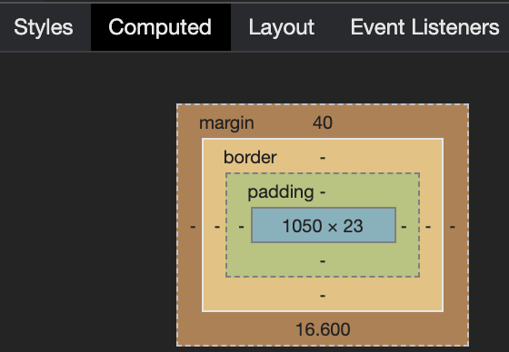
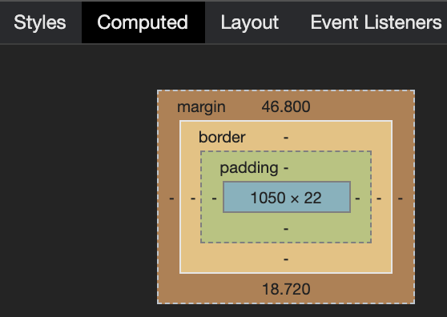
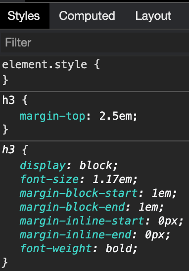
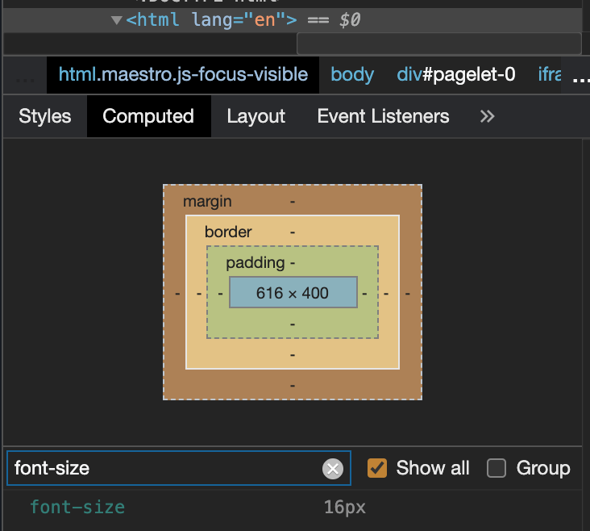
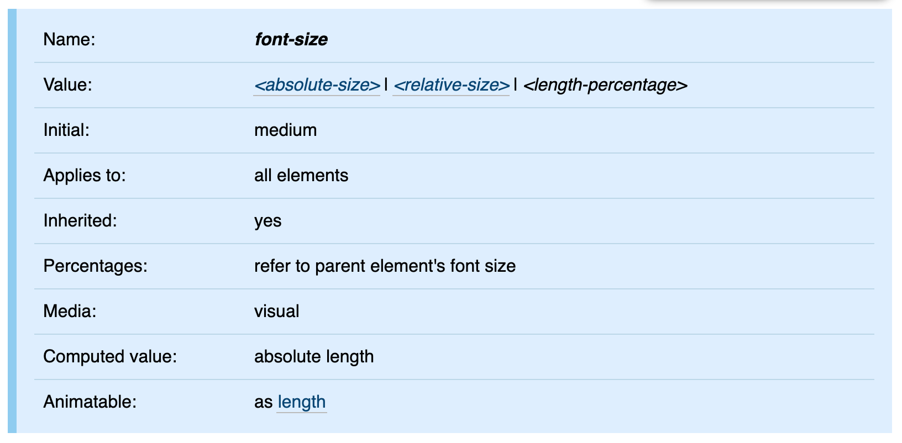
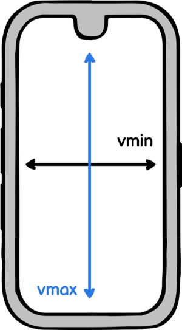
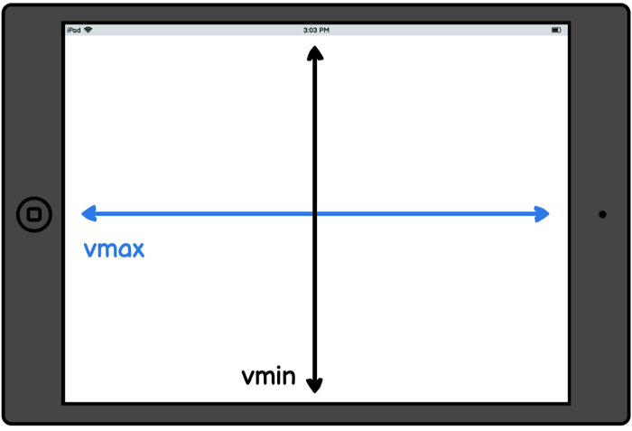
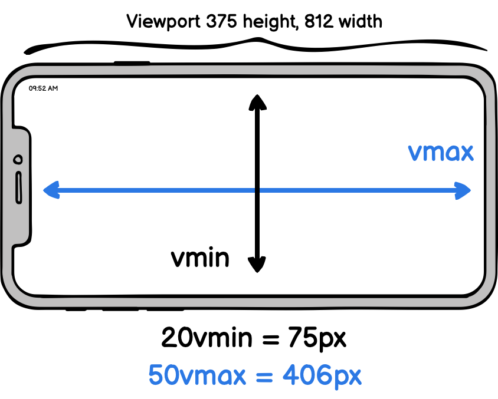

This article aims to demystify [relative length units](https://developer.mozilla.org/en-US/docs/Learn/CSS/Building_blocks/Values_and_units#Relative_length_units). In contrast to [absolute length units](https://developer.mozilla.org/en-US/docs/Learn/CSS/Building_blocks/Values_and_units#Absolute_length_units) (with `px` as the best known representative), relative length units specify a length relative to something else. This “something else” can be of various types, e.g., a parent element’s font size, the width of a parent container, or the height of the viewport.

_Originally published at [blog.logrocket.com](https://blog.logrocket.com/understanding-relative-css-units/)_

Both types of units have the term `length` in common, but what exactly is a length unit in this context? There are [font-relative length units](https://developer.mozilla.org/en-US/docs/Web/CSS/length#Font-relative_lengths) (e.g.,  `em`, `rem`), which are relative to characters or font-related properties of an element. Additionally, there are length units that are [relative to the viewport](https://developer.mozilla.org/en-US/docs/Web/CSS/length#Viewport-percentage_lengths) (e.g., `vw`, `vh`).

Another common CSS data type in the context of relative units is the percentage (`%`). There are also [CSS properties that accept integer values](https://stackoverflow.com/a/2130116). The most common use case for such a unitless value is to [use it with the line-height property](http://meyerweb.com/eric/thoughts/2006/02/08/unitless-line-heights/).

Relative units are especially important from the perspective of fluid layouts and web accessibility to [support users that rely on zooming](https://www.24a11y.com/2019/pixels-vs-relative-units-in-css-why-its-still-a-big-deal/). These fluid layouts are based on a proportional design, where lengths are defined in terms of percentages regarding a container.

Therefore, components based on relative units might change in size at runtime because they are (re)calculated with respect to a contextual container, e.g., by rotating a device or by decreasing the size of a browser window.

## Font-related CSS units

First, we’ll look at how the most common relative font-related CSS units work: `em` and `rem`.

##  CSS unit `em`

The browser converts an `em` value into a `px` value with respect to the current font size context. Let’s take a look at an example.

<p class="codepen" data-height="265" data-theme-id="light" data-default-tab="css,result" data-user="doppelmutzi" data-slug-hash="xqbyZb" style="height: 265px; box-sizing: border-box; display: flex; align-items: center; justify-content: center; border: 2px solid; margin: 1em 0; padding: 1em;" data-pen-title="CSS Unit em - Headings">
  <span>See the Pen <a href="https://codepen.io/doppelmutzi/pen/xqbyZb">
  CSS Unit em - Headings</a> by Sebastian Weber (<a href="https://codepen.io/doppelmutzi">@doppelmutzi</a>)
  on <a href="https://codepen.io">CodePen</a>.</span>
</p>
<script async src="https://cpwebassets.codepen.io/assets/embed/ei.js"></script>

What is the actual `margin-top` value for the `h2` element? Open the Chrome [DevTools](https://developers.google.com/web/tools/chrome-devtools), select the `h2`, and navigate to the **Computed** tab in the CSS section. The value is `40px`.




How did this value come about? The calculation formula for the considered CSS property (`margin-top`) of the HTML element (`h2`) is:

Multiply the `em` value (2) by the actual `font-size` value in `px` of the HTML element to be styled (20). For our example, this means: `2 * 20px = 40px`.

What about `margin-top` for the `h3` element in the example? The value in the end is `46.8px`.




Why is that? We haven’t declared a `font-size` value, as we did with the `h2` element. However, every element has a derived value — this is in the nature of things in CSS. 




As we can see, our `h3` element has a default `font-size` value of `1.17em`. OK, this is no `px` value, either. We have to go up the parent elements hierarchy until we find a `px` value.

With the help of DevTools, we find out that the `body` element has an absolute `font-size` value derived from browser default values since we haven’t specified a custom value.


With this information, our concrete value can be calculated: `2.5 * 1.17 * 16 = 46.8px`.

The next example demonstrates that `em` is not exclusive to styling text content; on the contrary, it can be used wherever you can use length units. It may seem a bit alienating at first, but you can style non-textual elements without any problems.

<p class="codepen" data-height="265" data-theme-id="light" data-default-tab="css,result" data-user="doppelmutzi" data-slug-hash="qBaKMzE" style="height: 265px; box-sizing: border-box; display: flex; align-items: center; justify-content: center; border: 2px solid; margin: 1em 0; padding: 1em;" data-pen-title="CSS Unit em (margin)">
  <span>See the Pen <a href="https://codepen.io/doppelmutzi/pen/qBaKMzE">
  CSS Unit em (margin)</a> by Sebastian Weber (<a href="https://codepen.io/doppelmutzi">@doppelmutzi</a>)
  on <a href="https://codepen.io">CodePen</a>.</span>
</p>

##  CSS unit `rem`

The font-related relative unit `rem` stands for "root em.” It correlates with the `font-size` of the root element of the browser (normally the `html` element). It’s easy to determine:


Multiply the `rem` value by the actual `font-size` value in `px` of the browser’s `html` element. 

Here’s an example.

<p class="codepen" data-height="265" data-theme-id="light" data-default-tab="css,result" data-user="doppelmutzi" data-slug-hash="NpqXpR" style="height: 265px; box-sizing: border-box; display: flex; align-items: center; justify-content: center; border: 2px solid; margin: 1em 0; padding: 1em;" data-pen-title="CSS Unit rem">
  <span>See the Pen <a href="https://codepen.io/doppelmutzi/pen/NpqXpR">
  CSS Unit rem</a> by Sebastian Weber (<a href="https://codepen.io/doppelmutzi">@doppelmutzi</a>)
  on <a href="https://codepen.io">CodePen</a>.</span>
</p>

The calculated `margin-top` value of the `h2` element is `32px` because the defined `rem` value (2) is multiplied by the absolute `font-size` value of the `html` element (`16px`). Because we haven’t provided a selector to define the `font-size` of the `html` element, it is a browser default.

For most (desktop) browsers, the default is `16px`. But to find out for sure, you can leverage the DevTools again.




Browser support is good. It can be used without problems except you have to develop for legacy browsers.

<p class="ciu_embed" data-feature="rem" data-periods="future_1,current,past_1,past_2">   
  <a href="http://caniuse.com/rem">Can I Use rem?</a> 
  Data on support for the rem feature across the major browsers from caniuse.com. 
</p>
<script src="https://caniuse.bitsofco.de/caniuse-embed.min.js"></script>


##  Working with `em`

It is a good idea to check out the W3C CSS standard documentation from time to time. Here, you can see that the `font-size` property [gets inherited](https://www.w3.org/TR/css-fonts-3/#propdef-font-size) from the HTML parent hierarchy.




Therefore, working with `em` can be tricky:


- Every HTML element inherits its `font-size` value from its parent HTML element
- If an `em`-based `font-size` is set for the root element (`html`), the `px` value results from multiplication with the browser’s default value. Some browsers allow for defining user values in settings that are then used

The consequence is that browser font settings can potentially influence every `em` value through inheritance. From an accessibility standpoint, this is crucial to support users that rely on zooming.

However, this might lead to a mostly unwanted behavior in nested elements styled with `em` values.

<p class="codepen" data-height="265" data-theme-id="light" data-default-tab="html,result" data-user="doppelmutzi" data-slug-hash="aJOzJR" style="height: 265px; box-sizing: border-box; display: flex; align-items: center; justify-content: center; border: 2px solid; margin: 1em 0; padding: 1em;" data-pen-title="em - inheritance problematic">
  <span>See the Pen <a href="https://codepen.io/doppelmutzi/pen/aJOzJR">
  em - inheritance problematic</a> by Sebastian Weber (<a href="https://codepen.io/doppelmutzi">@doppelmutzi</a>)
  on <a href="https://codepen.io">CodePen</a>.</span>
</p>


In our example, the `font-size` of deeper nested elements is larger than expected. Why is that?


- The `font-size` for level 1 `li` is `14px`: 
    - `1.4 (li selector) * 10px (inherited font-size from body)`
- The `font-size` for level 2 `li` is `19.6px`:
    - `1.4 (li selector) * 14px (inherited from level 1 li)`
- The `font-size` for level 3 `li` is even bigger at `27.44px`
    - `1.4 (li selector) * 19.6px (inherited from level 2 li)`

To solve this issue in a way that ensures all `li` elements have the same font size, you could add another selector.

```css
  li li { font-size: 1em; };
```

Keep this in mind for your CSS design. You most likely don’t want to use `em` in such a scenario; instead, use `rem`. 

##  Working with `rem`

Determining the calculated `px` value for a CSS property using a `rem` value is easy: you have to multiply the `rem` value by the `px` value of the `html` element. Use the DevTools (**Computed** tab) to find out whether you have set the value.

The list below provides greater detail on how the `px` value of the `html` element is determined:


- If you haven’t defined a custom `px` value for the `html` element, then the `px` value is inherited from the browser settings or the browser default values
- If you define the `font-size` of the `html` element with a `px` value, then this is what’s used for the calculation
- If you define the `font-size` of the `html` element with an `em` or `%` value, the actual `px` value is calculated with the help of the browser font settings or default values
- If you define the `font-size`  of the `html` element with a `rem` value, the `px` value of the `html` element is the result of multiplication with the browser font size settings or default values

The consequence is that browser font settings can influence every `rem` value in the CSS design. Using `rem` does not cause an “inheritance problem” of `font-size`, as you can see in the next example.


<p class="codepen" data-height="265" data-theme-id="light" data-default-tab="html,result" data-user="doppelmutzi" data-slug-hash="yMNBKr" style="height: 265px; box-sizing: border-box; display: flex; align-items: center; justify-content: center; border: 2px solid; margin: 1em 0; padding: 1em;" data-pen-title="CSS Unit rem - no inheritance effects">
  <span>See the Pen <a href="https://codepen.io/doppelmutzi/pen/yMNBKr">
  CSS Unit rem - no inheritance effects</a> by Sebastian Weber (<a href="https://codepen.io/doppelmutzi">@doppelmutzi</a>)
  on <a href="https://codepen.io">CodePen</a>.</span>
</p>

`font-size` definitions in the parent hierarchy are irrelevant because `rem` values are always correlated with the (calculated) `px` value of the single `html` element.

##  When to use `rem` and `em`

Using `rem` and `em` goes hand in hand with the topics of responsive design, usability, and accessibility.

The advantage of `rem` is unified sizing without `font-size` inheritance. As an application designer, you can react to user font settings in order to present content appropriately. This is important so as not to exclude users relying on an accessible design. When a user increases the font size, you have the opportunity to retain the integrity of the layout, e.g., text does not get squeezed into a small container of fixed width.

`em` is a powerful tool in the belt of every CSS developer. The underlying principle to style an element is to determine “sizing values” (e.g., `margin`, `width`) depending on `font-size` values of parent elements. Therefore, it is not limited to the root element (`html`).

One of the main benefits of `em` is its ability to establish proportional relationships between design elements within a context (e.g., a button or teaser module). Usage of `em` goes hand in hand with the issues of contextual scalability and responsive design. The next example demonstrates how `em` can be used for responsive component design.


<p class="codepen" data-height="265" data-theme-id="light" data-default-tab="css,result" data-user="doppelmutzi" data-slug-hash="BbNbpy" style="height: 265px; box-sizing: border-box; display: flex; align-items: center; justify-content: center; border: 2px solid; margin: 1em 0; padding: 1em;" data-pen-title="Responsive buttons with em unit">
  <span>See the Pen <a href="https://codepen.io/doppelmutzi/pen/BbNbpy">
  Responsive buttons with em unit</a> by Sebastian Weber (<a href="https://codepen.io/doppelmutzi">@doppelmutzi</a>)
  on <a href="https://codepen.io">CodePen</a>.</span>
</p>

The button component responsive structure is defined with the `button` selector. `border`, `padding`, and `border-radius` utilize relative units that relate to the defined `font-size` value. The different button sizes are defined with the concrete class selectors (e.g., `size-l`).

Since the `font-size` values are also `em` units, the concrete contextual value is derived from the concrete `px` values defined with the `main` and `footer` selectors.

The benefit of this approach is that you can easily reuse such components in different contexts. You just have to define different `font-size` values for the different context containers, and then inheritance does the rest.

## Relative CSS unit `%`

In CSS, percent (`%`) is not a length unit per se but a [data type](https://developer.mozilla.org/en-US/docs/Web/CSS/percentage). Using it feels like a length unit because you can apply it everywhere where you can use `px`, `em`, etc. So it’s fair to mention it in this context.

This data type always refers to a fraction of the parent component. A length defined in percentage is based on the length (computed value in `px`) of the same property of the parent element. The following example illustrates this:

```css
  main {
    width: 400px;
    height: 50%;
  }
  
  h1 {
    width: 50%;
  }

  <body>
    <main>
      <h1>hello world</h1>
    </main>
  </body>
```

The computed `width` of the `h1` element is half of its parent element `main`, i.e., `200px`. If the parent container is the `body` element, then the percentage always refers to the size of the browser viewport. In our case, the computed value of the `main` element’s `height` property is half the height of the computed value of the viewport container.

Let’s take a closer look at some nitty-gritty details. In the following CodePen, the gray background containers are the parent elements for the `h2` elements (the blue background).


<p class="codepen" data-height="265" data-theme-id="light" data-default-tab="css,result" data-user="doppelmutzi" data-slug-hash="BmmqQb" style="height: 265px; box-sizing: border-box; display: flex; align-items: center; justify-content: center; border: 2px solid; margin: 1em 0; padding: 1em;" data-pen-title="CSS percentage demo">
  <span>See the Pen <a href="https://codepen.io/doppelmutzi/pen/BmmqQb">
  CSS percentage demo</a> by Sebastian Weber (<a href="https://codepen.io/doppelmutzi">@doppelmutzi</a>)
  on <a href="https://codepen.io">CodePen</a>.</span>
</p>

The default behavior for a block-level element without a user-defined width is to occupy the [available horizontal space of the parent container](https://stackoverflow.com/a/28354270/3116979), as you can see with **demo 1**. The horizontal padding (the dark-blue background) of our `h2` is not added to the total width.

However, as you can see with **demo 2**, defining an explicit `width: 100%` causes a horizontal scrollbar to be displayed. Why is that?

In contrast to **demo 1**, wherein the default `width` has the value `auto`, defining a percent value includes `padding`, `margin`, and `border` in its calculation and enables children to overgrow the width of their parent container. You can read about it in the [CSS spec](https://www.w3.org/TR/CSS21/visudet.html#blockwidth).

In **demo 3**, we specify `width: 100%`, too, but we do not have a horizontal scrollbar. This is because the children’s `border` and `padding` is not adding to the horizontal spacing due to the fact that we changed the default from `box-sizing: content-box` to `box-sizing: border-box`. It is not unusual that you define a global selector to use `border-box` throughout your CSS design.

With **demo 4** and **demo 5**, you can see the percentage does not necessarily relate to the direct parent element but an element further up in the parent tree.

## Viewport units

Percentage values (`%`) always refer to the parent element. However, [viewport unit](https://www.w3.org/TR/css3-values/#viewport-relative-lengths) values represent a percentage of the current browser viewport.

Values of viewport units are determined based on the viewport container’s width (`vw`) and height (`vh`). The value range is between 1 and 100:


- `1vw` is 1 percent of the viewport’s width; similarly, `1vh` is 1 percent of the viewport’s height
- `100vw` is 100 percent of the viewport’s width; likewise, `100vh` is 100 percent of the viewport’s height

The most obvious use case for viewport units is to use them for top-level containers that take occupy space in relation to the viewport size; there is no cascading or influence by parent elements involved. In contrast to `%`, for viewport units, it does not matter where in the markup the element to be styled resides.

So `100vw` can be used for full-width sections, right? Yes — but with a caveat.

The `border` and `margin` of the element are not considered, so as you can see in the next example, the **header** container exceeds the browser viewport, and a horizontal scrollbar is shown. The **article** container solves this problem by setting the `box-sizing` property from its default value of `content-box` to `border-box`.

<p class="codepen" data-height="265" data-theme-id="light" data-default-tab="css,result" data-user="doppelmutzi" data-slug-hash="MWjGQgd" style="height: 265px; box-sizing: border-box; display: flex; align-items: center; justify-content: center; border: 2px solid; margin: 1em 0; padding: 1em;" data-pen-title="Viewport units demo">
  <span>See the Pen <a href="https://codepen.io/doppelmutzi/pen/MWjGQgd">
  Viewport units demo</a> by Sebastian Weber (<a href="https://codepen.io/doppelmutzi">@doppelmutzi</a>)
  on <a href="https://codepen.io">CodePen</a>.</span>
</p>

For the **main** container, we prevent this issue with another approach by using `calc()` to subtract the border widths and margins on both sides.

If your use case is to get a full-width section, it’s easier to use the good old `width: 100%` (the default with `display: block`), as you can see in the **footer** container. Using `width: 100%` is superior because older browsers [can experience issues](https://stackoverflow.com/a/30504010) when scrollbars are shown.

A more beneficial use case is to use the `vh` unit in relation to the height of the viewport. If you want to stretch a container to the height of the viewport, `vh` is superior to `%` because the latter relates to the parent. Thus, with the `%` unit, you have to use fixed layout techniques to ensure the parent container fills the height of the viewport.

The following sticky footer example leverages `vh` to have a component at the bottom of the viewport.

<p class="codepen" data-height="265" data-theme-id="light" data-default-tab="css,result" data-user="doppelmutzi" data-slug-hash="bqNoBK" style="height: 265px; box-sizing: border-box; display: flex; align-items: center; justify-content: center; border: 2px solid; margin: 1em 0; padding: 1em;" data-pen-title="sticky footer with flexbox">
  <span>See the Pen <a href="https://codepen.io/doppelmutzi/pen/bqNoBK">
  sticky footer with flexbox</a> by Sebastian Weber (<a href="https://codepen.io/doppelmutzi">@doppelmutzi</a>)
  on <a href="https://codepen.io">CodePen</a>.</span>
</p>

Associated units are `vmin` and `vmax`:


- `20vmin` relates to `20vw` or `20vh`, whichever is smaller
- `10vmax` relates to `10vw` or `10vh`, whichever is larger

Let’s rephrase the explanation: as an example, `10vmin` will resolve to 10 percent of the current viewport width in portrait orientations, and 10 percent of the viewport height on landscape orientations.






The following picture gives an example on how the final pixel value is calculated for both units.




What is it good for? Not many use cases come to mind —  but it’s another tool in your bag as a web developer.

In some circumstances, it serves you better than media queries. With media queries, you have to think in “gates.” Due to the almost infinite number of devices and form factors, however, this approach does not always scale. You can think of `vmin` and `vmax` more as fluid length units.

When you search for use cases, you often come across responsive hero text components. The next CodePen demonstrates that `vmin` improves the responsive behavior in contrast to `vw`. In this case, the ratio of the text to the screen width in landscape mode is more coherent.

<p class="codepen" data-height="265" data-theme-id="light" data-default-tab="html,result" data-user="doppelmutzi" data-slug-hash="MWjqaOa" style="height: 265px; box-sizing: border-box; display: flex; align-items: center; justify-content: center; border: 2px solid; margin: 1em 0; padding: 1em;" data-pen-title="Hero text with vmin">
  <span>See the Pen <a href="https://codepen.io/doppelmutzi/pen/MWjqaOa">
  Hero text with vmin</a> by Sebastian Weber (<a href="https://codepen.io/doppelmutzi">@doppelmutzi</a>)
  on <a href="https://codepen.io">CodePen</a>.</span>
</p>
 
Browser support is very good, even for Internet Explorer 9, except you want to use `vmax`.

<p class="ciu_embed" data-feature="viewport-units" data-periods="future_1,current,past_1,past_2">   
  <a href="http://caniuse.com/viewport-units">Can I Use rem?</a> 
  Data on support for the viewport-units feature across the major browsers from caniuse.com. 
</p>

However, the devil’s in the details when it comes to mobile devices. The calculation especially of `vh` is [not consistent in all mobile browsers](https://stackoverflow.com/questions/37112218/css3-100vh-not-constant-in-mobile-browser) because the spec is vaguely formulated. There are some [tricks to cope with it](https://css-tricks.com/the-trick-to-viewport-units-on-mobile/), however.

## Common use cases

In this section, I want to show some responsive patterns that are possible by combining the different relative units.

##  Combining `em` and `rem` for local and global scaling

[This Code Pen by Chris Coyier](https://codepen.io/chriscoyier/pen/tvheK) impressively demonstrates, with the help of sliders, how `rem` and `em` can be leveraged for global (i.e., the whole website) and local (i.e., inside a module) scaling. This shows how you can build your layout with inclusive design in mind by reacting to the font size settings of the user.

<p class="codepen" data-height="265" data-theme-id="light" data-default-tab="html,result" data-user="chriscoyier" data-slug-hash="tvheK" style="height: 265px; box-sizing: border-box; display: flex; align-items: center; justify-content: center; border: 2px solid; margin: 1em 0; padding: 1em;" data-pen-title="Em AND Rem">
  <span>See the Pen <a href="https://codepen.io/chriscoyier/pen/tvheK">
  Em AND Rem</a> by Chris Coyier  (<a href="https://codepen.io/chriscoyier">@chriscoyier</a>)
  on <a href="https://codepen.io">CodePen</a>.</span>
</p>

There’s a subtle difference between this approach and the button example we discussed above. Using `rem` values instead of `px` values — and, in addition, not defining a fixed `font-size` value for the root element — respects user font size settings to improve accessibility.

##  Full-width containers in limited-width parents

Consider a scenario in which the structure of the markup is not fully under your control. If you work with some kind of CMS, you may find yourself in a situation where you have a limited-width container, but you want to make children elements break out.

The [next CodePen](https://codepen.io/doppelmutzi/pen/abmMWgY) shows how to break out of a bounded container and span the entire horizontal space with the help of `vw`.


<p class="codepen" data-height="265" data-theme-id="light" data-default-tab="html,result" data-user="doppelmutzi" data-slug-hash="abmMWgY" style="height: 265px; box-sizing: border-box; display: flex; align-items: center; justify-content: center; border: 2px solid; margin: 1em 0; padding: 1em;" data-pen-title=" Full-width containers in limited-width parents">
  <span>See the Pen <a href="https://codepen.io/doppelmutzi/pen/abmMWgY">
   Full-width containers in limited-width parents</a> by Sebastian Weber (<a href="https://codepen.io/doppelmutzi">@doppelmutzi</a>)
  on <a href="https://codepen.io">CodePen</a>.</span>
</p>

The important code is part of the `.break-out` selector. If you’re curious about the code, take a look at the following derivation of  `margin-left`:

```css
  .break-out {
    // 500px because of the max width of the container
    margin-left: calc(-100vw / 2 + 500px / 2);
    // replace 500px with 100%
    margin-left: calc(-50vw + 50%);
  }
```
You can read detailed explanations with different scenarios and techniques at [CSS-Tricks](https://css-tricks.com/full-width-containers-limited-width-parents/) and [Cloud Four](https://cloudfour.com/thinks/breaking-out-with-viewport-units-and-calc/).

##  Fluid typography

Let’s put it in a nutshell — most of the time, text content plays a very important part on the page. Due to the variety of screen sizes, fluid typography has grown more and more important.

Fluid typography that uses viewport units (`vw`, `vh`) dynamically adjusts the font size to the viewport. This leads to a more harmonic and suitable presentation in contrast to responsive typography based on breakpoints.

Here is a naive example:

```css
  h1 { font-size: 4vw; }
  p { font-size: 2vw; }
```

But wait — a better approach is to do the following:

```css
  html { font-size: 3vw; }
```

Why? Because we leverage the Browser’s default values with accessibility in mind. The HTML tags for `h1` and `p` are defined with relative `font-size` values (`em`), so you don’t have to think about relativity between paragraph text, headlines, etc. Of course, you can define your own font sizes if you wish to optimize your design.

But our approach has a problem: the font size is too tiny for small viewport widths.


So we need some lower and upper bounds so that the text neither shrinks nor grows too much for small or large screen widths, respectively. We can use [media queries](https://developer.mozilla.org/en-US/docs/Web/CSS/Media_Queries/Using_media_queries) to define such boundaries, but then we wind up with these inharmonious jumps between the breakpoints.

A better approach is to omit media queries in the first place.

<p class="codepen" data-height="265" data-theme-id="light" data-default-tab="html,result" data-user="doppelmutzi" data-slug-hash="bGwZXJx" style="height: 265px; box-sizing: border-box; display: flex; align-items: center; justify-content: center; border: 2px solid; margin: 1em 0; padding: 1em;" data-pen-title="Fluid typography">
  <span>See the Pen <a href="https://codepen.io/doppelmutzi/pen/bGwZXJx">
  Fluid typography</a> by Sebastian Weber (<a href="https://codepen.io/doppelmutzi">@doppelmutzi</a>)
  on <a href="https://codepen.io">CodePen</a>.</span>
</p>

The algorithm used in the CodePen above is based on the approach described by [CSS-Tricks](https://css-tricks.com/snippets/css/fluid-typography/). [Christine Vallaure](https://medium.com/sketch-app-sources/truly-fluid-typography-257a2b434105) does a nice job of explaining the rationale behind this algorithm.

```css
  html {
    font-size: calc([minimum size] + ([maximum size] - [minimum size]) * ((100vw - [minimum viewport width]) / ([maximum viewport width] - [minimum viewport width])));
  }
```

[Tim Brown](https://blog.typekit.com/2016/08/17/flexible-typography-with-css-locks/) also transfers the concept to fluid `line-height`.

<p class="codepen" data-height="265" data-theme-id="light" data-default-tab="html,result" data-user="timbrown" data-slug-hash="akXvRw" style="height: 265px; box-sizing: border-box; display: flex; align-items: center; justify-content: center; border: 2px solid; margin: 1em 0; padding: 1em;" data-pen-title="CSS calc lock for line-height">
  <span>See the Pen <a href="https://codepen.io/timbrown/pen/akXvRw">
  CSS calc lock for line-height</a> by Tim Brown (<a href="https://codepen.io/timbrown">@timbrown</a>)
  on <a href="https://codepen.io">CodePen</a>.</span>
</p>

##  Custom scroll indicator with `vh`

The following example shows a clever trick to combine `%` with `vh` units to create a pure CSS scroll indicator.

<p class="codepen" data-height="265" data-theme-id="light" data-default-tab="html,result" data-user="MadeByMike" data-slug-hash="ZOrEmr" style="height: 265px; box-sizing: border-box; display: flex; align-items: center; justify-content: center; border: 2px solid; margin: 1em 0; padding: 1em;" data-pen-title="CSS only scroll indicator">
  <span>See the Pen <a href="https://codepen.io/MadeByMike/pen/ZOrEmr">
  CSS only scroll indicator</a> by Mike (<a href="https://codepen.io/MadeByMike">@MadeByMike</a>)
  on <a href="https://codepen.io">CodePen</a>.</span>
</p>

## Conclusion

Understanding relative units is key for fluid layouts or responsive designs (call it whatever you want) that enable CSS to cope with the virtually unlimited variety of viewport sizes and dpi.

Font-based units might feel odd at first, but after gaining some experience, you’ll recognize their benefit over absolute units. Viewport units, especially `vh`, are useful, but it’s important to understand when to use them and when to use the good old `%` data type.

An all-too-often overlooked aspect of developing websites is to make them accessible. By their very nature, these relative units respect user-specific font sizes and zoom settings.

There are [more relative units on the horizon](https://developer.mozilla.org/en-US/docs/Web/CSS/length#specifications), but no browser currently supports them. Thankfully, we can already work very well with the current representatives.

