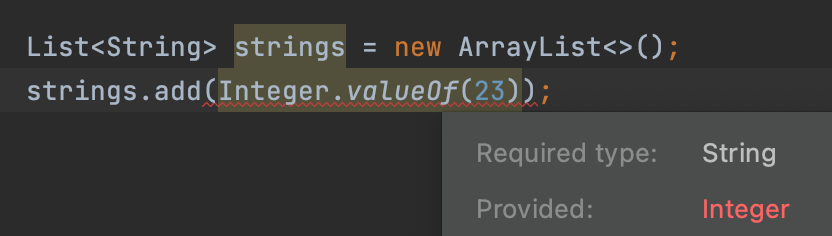

I'm re-learning Java, which I have already dealt with in large parts of the 2000s. In addition to pair-programming with my experienced work colleagues, I plan to pick out language features and concepts, and deal with them more intensively. In this article I describe my learnings about the chapter "Don't use raw types" part of the excellent [book "Effective Java"](https://www.amazon.com/-/en/Joshua-Bloch/dp/0134685997/ref=sr_1_1). This constitutes a good starting point to learn about [generics](https://www.baeldung.com/java-generics).

The key message from the article is to never ever opt-out from the generic type system. Using raw types prevents the compiler to raise errors at development time. Instead, you might come up with runtime errors. Tracking down the bug might be difficult because the issue might occur in a completely other spot away from the source of evil. 

The chapter is all about generics. It is a good source to learn about different concepts and terminology of generics. It focuses on the advantages of using the generic type system and contrasts the problems of raw types.

It is also important to note that the examples below to discuss the topic of the book chapter are by no means good practice. There exists advanced generics features like [bounded types](https://docs.oracle.com/javase/tutorial/java/generics/bounded.html) and [bounded wildcard types](https://docs.oracle.com/javase/tutorial/java/generics/upperBounded.html) that should be used in professional projects. You should also never work with the type `Object`!

`List<E>` is an example of a _generic interface_, because it's [declaration](https://docs.oracle.com/javase/8/docs/api/java/util/List.html) consists of at least one _type parameter_, in this case `E`. There exists generic classes, too. Both, generic interfaces and classes, can also be called _generic types_.

`List<String>` is a parameterized type, which elements are of type `String`. Thereby, `List` is the actual _raw type_, `String` represents the _type parameter_, and `E` constitutes the _formal type parameter_ defined in the type declaration (`List<E>`).

This article explains why you shouldn't use _raw types_ directly. The question is why does Java allow it in the first place? For compatibility reasons there still exist this concept, because generics have been first introduced with JDK 5.0. That's the reason why the compiler even with recent JDK versions erases all generic type information. So, in the end you come up with code that uses raw types directly. 

In fact, before the introduction of generics, there only existed raw types, so you had to use `List` directly and cast its elements manually. It's still legal to use generic types without their type parameters in the old way.

```java
List myHobbies = new ArrayList();
myHobbies.add(new Coding());
myHobbies.add(new Crossfit());
Crossfit crossfit = (Crossfit) myHobbies.get(1);
```

This works but is not recommended. The compiler points this out with _unchecked call_ warnings.


Why is this code problematic? Because you have to know the concrete types of every item to make the correct cast. This is a real problem with dynamic code.

```java
for (Iterator hobbiesIterator = myHobbies.iterator(); hobbiesIterator.hasNext();) {
    Crossfit hobby = (Crossfit) hobbiesIterator.next();
    System.out.println(hobby);
}
```

This compiles but it leads to a runtime error due to a illegal cast.


The correct way is to utilize generic type parameters in case you use generic classes or generic interfaces. Using the wrong types leads then to compiler-time errors.

```java
List<Crossfit> moreHobbies = new ArrayList<>();
moreHobbies.add(new Crossfit());
moreHobbies.add(new Coding());
```


But I would like to use different hobbies (i.e., different types) in my list, what can I do - yes, it's clear to me that this is a bad idea. Ok, then you better use `List<Object>`.

```java
List<Object> evenMoreHobbies = new ArrayList<>();
evenMoreHobbies.add(new Crossfit());
evenMoreHobbies.add(new Coding());
```

This is a parameterized type representing a list that can contain objects of any type. What's the difference to using the raw type `List`? Again, you lose all the safety and expressiveness benefits that the generic type system provides. The difference is subtle. `List<Object>` gives the compiler more information of what you have in mind as a developer: You explicitly tell the list is capable of holding any type of objects.

One consequence is that the compiler does not allow to assign a list of strings to a list of objects due to sub-typing rules: `List<String>` is a sub-type of raw type `List` but not of the parameterized type `List<Object>`. Thereby, the compiler guarantees that you can only add values of type `Object`.

```java
List list1;
List<String> stringList = new ArrayList<>();
list1 = stringList;

List<Object> list2;
list2 = stringList;
```


Let's explore more what you give up when you opt-out of the generic type system, i.e., what it means to loose type-safety.

```java
List<String> strings = new ArrayList<>();
strings.add(Integer.valueOf(23));
```

Adding a number to our string list is prevented by the compiler. This is an example for utilizing type-safety of generics.



However, the following `unsafeAdd` method bypasses the type-safety mechanism.

```java
public static void main(String[] args) {
  List<String> strings = new ArrayList<>();
  unsafeAdd(strings, Integer.valueOf(41));
  String s = strings.get(0); // compiler-generated cast
  s.contains("hello world"); // runtime-error
}

private static void unsafeAdd(List list, Object o) {
  list.add(o);
}
```

Because we extracted the code for adding into a method that adds a `Object` to a raw type list, we cause a runtime error.


Again, we ignore the compiler warnings and take negligently the risk of a runtime error.


If you are in the situation that you have a method to work on a list (or other raw type) whose element types are unknown or you don't care about them, you better use [unbounded wildcard types](https://docs.oracle.com/javase/tutorial/extra/generics/wildcards.html) (`List<?>`). So the major reason to use the wildcard version is to maintain type-safety.

You might ask, what's the difference between `List<Object>` and `List<?>`?

```java
List<Object> objList = new ArrayList<>();
List<?> wildcardList = new ArrayList<String>();
objList.add(""); // works
wildcardList.add("");// compile-time error
```

You cannot assign a value to a list of _wildcard type_. But you can use leverage it for type-save checks. Consider the following code, where a `Stats` class with a _bounded type_ (`T extends Number`) is defined to calculate the average of numeric values.

```java
class Stats<T extends Number> {
    T[] numbers;

    Stats(T[] o) {
        numbers = o;
    }

    double average() {
        double sum = 0.0;
        for (int i=0; i < numbers.length; i++) {
            sum += numbers[i].doubleValue();
        }
        return sum / numbers.length;
    }

    boolean sameAverage(Stats<?> o) {
        if (average() == o.average()) return true;
        return false;
    }
}

public static void main(String[] args) {
  Integer intNumbers[] = { 2, 4};
  Stats<Integer> intStats = new Stats<>(intNumbers);
  Double doubleNumbers[] = { 2.0, 4.0 };
  Stats<Double> doubleStats = new Stats<>(doubleNumbers);

  System.out.println("same average? " + intStats.sameAverage(doubleStats));
  // System.out.println("same average? " + intStats.sameAverage(23)); // compile-time error
  // System.out.println("same average? " 
  // + intStats.sameAverage(new Stats<String>("hello world"))); // compile-time error
}
```

The method `sameAverage` makes use of a _wildcard type_. You cannot pass anything into the method other than a numeric value (i.e., a sub-class of `Number`). You have to understand that the wildcard does not affect what type of `Stats` objects can be created or what actual type can be passed to the `same Average` method. The class declaration (`T extends Number`) does this.

A key take-away of this article is to never use raw types and instead use the generic type system. Then, the compiler has the possibilities to find wrong type assignments already at development time.
