This article addresses an important issue in software development projects: keeping dependencies up to date. Updating dependencies closes potential security vulnerabilities and allows us to use recent features and apply bug fixes. Here, I demonstrate an approach to update dependencies automatically in CI/CD environments using [Renovate](https://github.com/renovatebot/renovate).

## What problem does Renovate tackle?

Take a look into your `package-lock.json` or `yarn.lock` files and you’ll surely notice you’re dealing with hundreds if not thousands of dependencies every day. Dependencies cause problems sooner or later:


- Maintenance efforts increase over time due to breaking changes, major updates, etc.
- At some point, it may no longer be feasible to keep projects updated simply because so many dependency updates pop up on a daily basis
- Security vulnerabilities become more likely

So on the one hand, [you should update dependencies](https://blog.logrocket.com/how-to-keep-javascript-libraries-up-to-date/) to more recent versions to utilize new features, benefit from performance improvements, or close security gaps. On the other, updating dependencies is a tedious task that consumes a lot of your team's time and delays their work on improving your product and building new features.

You normally benefit from timely updates that involve only small version jumps because chances are good that updating does not break your build. Waiting too long means your team has to spend a lot of effort to perform bulk updates, especially if major updates are involved. 

If you update many dependencies at once, you might have the following problems:

- Your build is broken — which dependency is to blame?
- Your build is OK, you've merged all dependencies, but your deployment is broken — which dependency caused it? 

It's fair to say that it is not sustainable to perform these manual dependency updates periodically. You need tool support — thank goodness there’s Renovate!

## How does Renovate help?

[Renovate](https://github.com/renovatebot/renovate) is an open source project designed to update dependencies automatically. It scans the package files (e.g., `package.json`, `pom.xml`) of assigned projects and creates merge requests (MRs) or pull requests (PRs), depending on your CI/CD tool's naming convention (I use the term MR going forward).

You can even push the game so far that you can have the MR automatically merged when the CI pipeline is green (i.e., build is OK, linting is OK, and all tests are successful). The latter is one step towards continuous deployment, which might be one of your team’s goals.

Note that Renovate does not analyze your projects for security like [OWASP](https://owasp.org/) does. But one could argue that if you keep your dependencies up to date, there will be a positive effect on security, and vulnerabilities are eliminated sooner or later. Of course, you can combine Renovate with specialized tools for vulnerability detection.

## How does Renovate integrate into your workflow?

Renovate supports many [CI/CD tools](https://docs.renovatebot.com/modules/platform/) and [languages](https://docs.renovatebot.com/modules/manager/). This articles describes how to use it with GitHub and GitLab on-premises.

We configure a Renovate "bot" that can be triggered manually or automatically by a scheduler. The bot scans all assigned projects and creates one or more MRs depending on your configuration and identified dependency updates. Renovate offers multiple ways to reduce noise — for example, by defining group rules to combine multiple dependencies into one MR or to auto-merge specific MRs

Renovate allows for fine-grained configuration. Its configuration concept is inspired by ESLint or Spring. You can define global configurations that get inherited by every project configuration. In addition, you can define project-specific configurations: extend the inherited base configuration and override existing settings (e.g., auto-merge is set to false globally, but you activate it in one specific project configuration).

You can define rules on many levels: on the project level, on the dependency type level (e.g., only for dev dependencies), or a specific dependency (e.g., ignore TypeScript >v4.2). Renovate pursuits the concept of convention over configuration. This means, the base configuration comes with many meaningful settings out of the box. In addition, you can choose from compiled lists of settings (setting presets and full config presets).

As we’ll see next, Renovate provides documentation directly into MRs or mail notifications, informing us which configuration is active and which dependencies are about to be updated, as well as inlining release notes and providing tips to proceed.

## Using the Renovate app for GitHub

Setting up [Renovate for Git](https://docs.renovatebot.com/install-github-app/)[Hub](https://docs.renovatebot.com/install-github-app/) means to install the associated [Renovate app](https://github.com/apps/renovate).  The only thing you can configure is which repositories are scanned by the Renovate bot (i.e., app). All other settings are configuration by code.

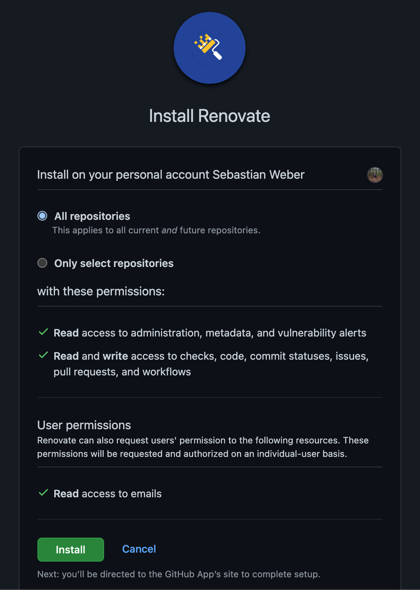


After installation, you can find the configuration settings in the [Applications](https://github.com/settings/installations) [section](https://github.com/settings/installations) by clicking your profile picture > Settings > Application. 

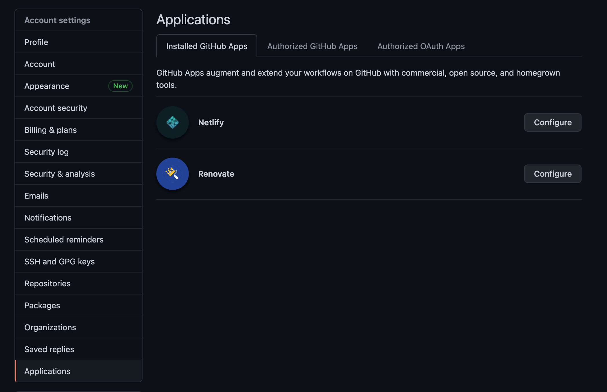


Click on **Configure** and scroll to the bottom of the config page to change the access to your repositories afterwards.

### Onboarding

Have no fear — Renovate does not update dependencies yet. You'll first receive an onboarding MR in each repository you’ve granted Renovate access to. In my example, the bot analyzes the single configured repository and describes what will happen next, so there are no surprises. 

As you can see in the screenshot below, Renovate has created an onboarding MR with the title “Configure Renovate.”

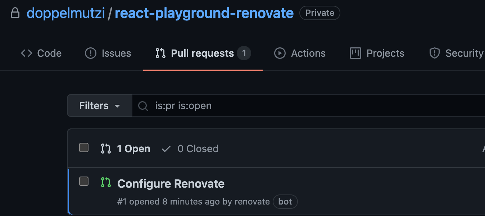


If you open the PR, you’ll see a very detailed description of what happens after merging.

First of all, you’ll be notified that Renovate has detected a `package.json` file. Renovate then applies the default configuration presets and lists the concrete configuration. To do so, Renovate will create a project-specific configuration file (`renovate.json`). As already mentioned, we can change the configuration later.


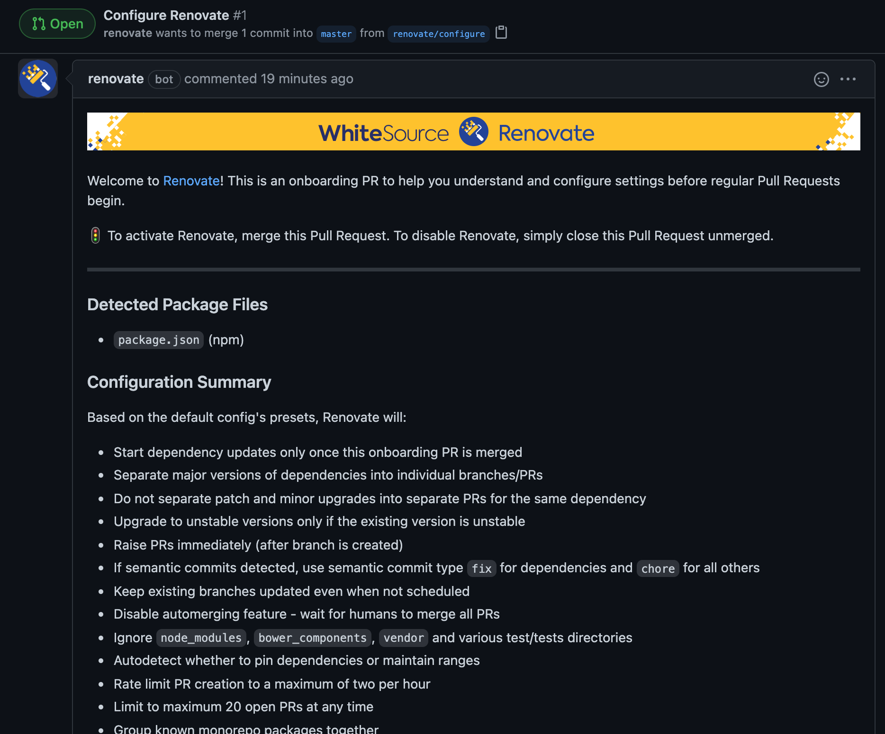


Under the “What to Expect” section, Renovate describes in detail which dependencies gets updated and how.

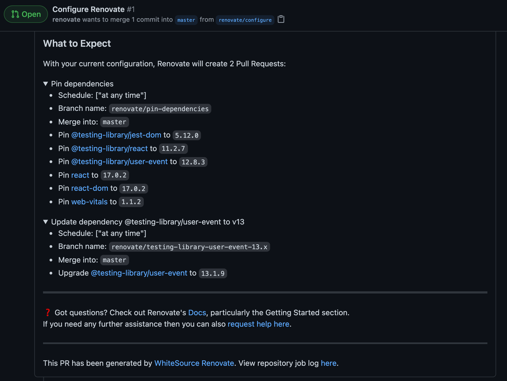


This actually says that we use the default configuration (`config:base`) provided by Renovate. Renovate provides [default configuration presets](https://docs.renovatebot.com/presets-default/) (e.g., `:automergeDisabled`) we can use in our configuration, as we’ll see soon. In addition, it groups multiple presets into [full config presets](https://docs.renovatebot.com/presets-config/). `config:base` and `config:semverAllMonthly` are examples of such full config presets.

Let's merge this to activate Renovate for our project.

### The first dependency updates

As described by the onboarding MR, two more MRs are created.


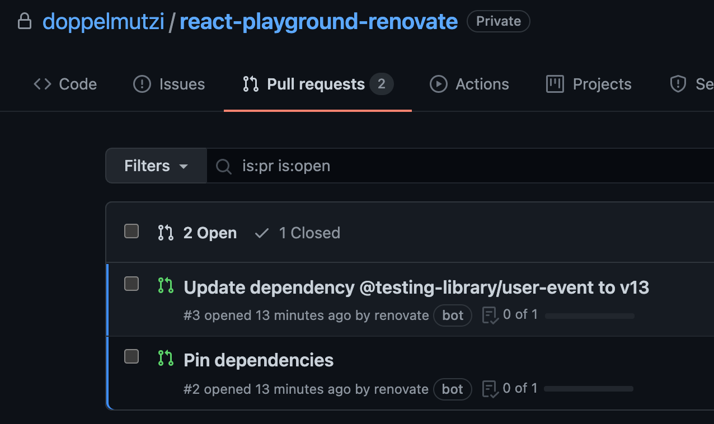


Let's take a look at a the first MR, constituting a concrete dependency update MR. 


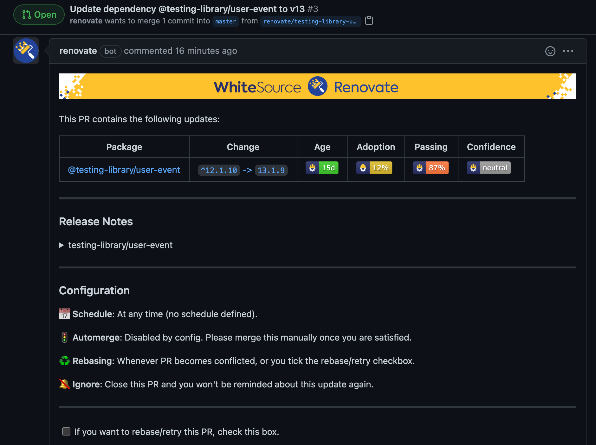


The MR describes in detail what will happen. In this example project, the `@testing-library/user-event` dependency gets updated to v13.1.9. 

What I like is that you can verify your Renovate config in the **Configuration** section. As an example, no auto-merge is defined yet because of the default configuration, so we have to merge the MR manually. We will see how to change this later.

In addition, if you expand the section, you have access to the release notes.


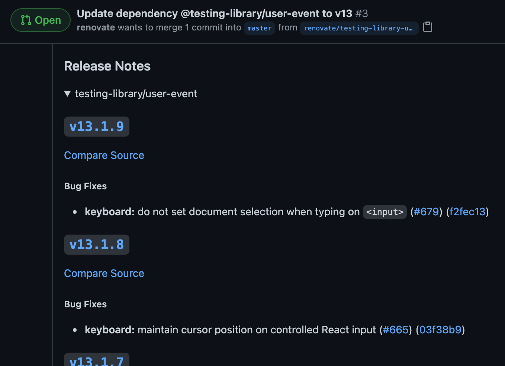


The second MR [pins dependencies](https://docs.renovatebot.com/dependency-pinning/), i.e., removes semantic version ranges. This behavior — you've guessed it — [can be changed](https://docs.renovatebot.com/presets-default/#preservesemverranges).


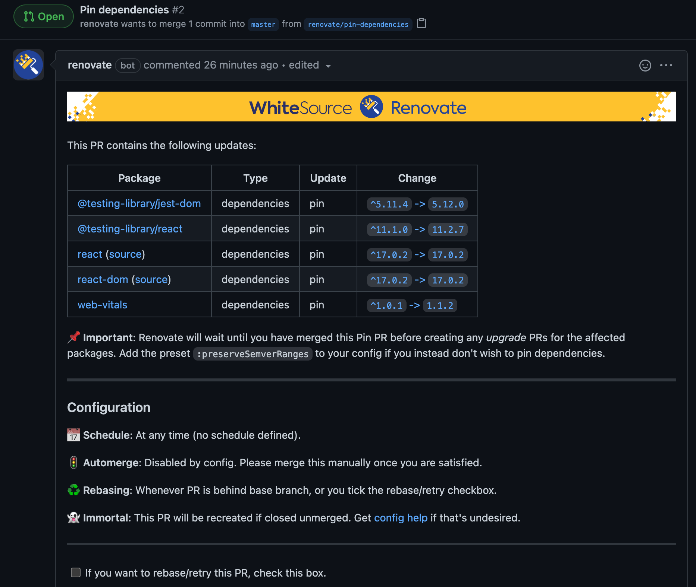


Details on pinning are [discussed in detail in the docs](https://docs.renovatebot.com/dependency-pinning/).

### Extend the default configuration

After merging the initial onboarding MR, we find a `renovate.json` file in our root folder.

```json
{
    "extends": [
        "config:base"
    ]
}
```

In the `extends` array, initially one full config preset (`[config:base](https://docs.renovatebot.com/presets-config/#configbase)`) is defined that represents the default base configuration for all languages. Such a full config preset is a collection of default presets. The following is an excerpt for `config:base`:

```json
{
    "extends": [
        // ...
        ":ignoreUnstable",
        ":prImmediately",
        ":automergeDisabled",
        ":prHourlyLimit2",
        ":prConcurrentLimit20",
        "group:monorepos",
        "group:recommended",
        // ...
    ]
}
```

With this configuration, Renovate is armed. But we have a huge selection of [configuration options](https://docs.renovatebot.com/configuration-options/) at our disposal, so let’s revise our configuration.

```json
{
    "extends": [
        "config:base"
    ],
    "automerge": true,
    "automergeType": "pr",
    "timezone": "Europe/Berlin",
    "schedule": [
        "after 3pm every day",
        "before 5am every day"
    ]
}
```

We override the default merge behavior defined by `config:base` (i.e., `:automergeDisabled`) and instruct Renovate to automatically merge MRs.

In addition, we override the default scheduling behavior by defining a custom schedule. The default value for `schedule` is "at any time," which is functionally the same as declaring a null schedule; in other words, Renovate will run on the repository around the clock. We defined a schedule to update dependencies every day between 3 PM and 5 AM.

It’s worth reading up on the [valid timezone names](https://en.wikipedia.org/wiki/List_of_tz_database_time_zones) as well as [Renovate's schedule options](https://docs.renovatebot.com/configuration-options/#schedule). We can also use one of the [schedule presets](https://docs.renovatebot.com/presets-schedule/), such as [schedule:nonOfficeHours](https://docs.renovatebot.com/presets-schedule/#schedulenonofficehours).

### Auto-merging

By default, Renovate only [performs an auto-merge](https://docs.renovatebot.com/automerge-configuration/) [by default](https://docs.renovatebot.com/automerge-configuration/) if you configured a workflow with at least one running test; otherwise, you need to add `"requiredStatusChecks": null` to your configuration. If MRs require approvals, this presents another obstacle to auto-merging. In such a case, you need to use the [GitHub helper app](https://github.com/apps/renovate-approve).

### Removing noise

If you scan multiple projects with different technologies involved, the number of MRs can soon become overwhelming. Defining auto-merging rules is a great lever to solve this possible.

This requires [merge confidence](https://docs.renovatebot.com/merge-confidence/) by working toward a high test coverage. If this is currently not possible or only a long-term goal, you may be able to argue that only patch-level dependencies are auto-merged because the risk for breaking your application is manageable.

To that end, you can utilize [packageRules](https://docs.renovatebot.com/configuration-options/#packagerules), a powerful feature that lets you apply rules to individual packages (e.g., only TypeScript >v4.2) or to groups of packages (e.g., only `devDependencies` of patch-level dependencies) using regex pattern matching. 

For example, we could add the following `packageRule` to enable auto-merging only for patch-level dependencies:

```json
"packageRules": [
    {
        "updateTypes": [
            "patch"
        ],
        "automerge": true
    }
]
```

Another option is to [group dependencies according defined rules](https://docs.renovatebot.com/configuration-options/#group) to reduce the effort for manual merges. The following `packageRule` groups all patch-level `devDependencies` and `dependencies`:

```json
{
    "packageRules": [
        {
            "matchDepTypes": ["devDependencies", "dependencies],
            "matchUpdateTypes": ["patch"],
            "groupName": "(dev) dependencies (patch)"
        }
    ]
}
```

In the case of a bug, though, this may lead to the problem that you have to track down which dependency update caused it.

A pragmatic option to reduce noise is to revise your scheduler and reduce the frequency. In my project, we also use technology to stay informed about vulnerabilities. If a security breach was detected, you still have the chance to perform manual dependency updates.

## Using Renovate with GitLab on-premises

If you run GitLab in-house, this section describes how to get a Renovate bot up and running. In the following sections, I show a GitLab project constituting a Renovate bot that creates MRs for other GitLab projects whenever dependencies are found in compliance with the defined rules. This is an additional step in contrast to the previous section, where we used a GitHub app.

It's important to understand that configurations for your repositories (e.g., auto-merge setup) is identical to the GitHub approach. The workflow is identical, too — onboarding, pin MRs, etc. The difference lies in how to set up the Renovate bot.

### Creating a Renovate bot

In contrast to using Renovate with GitHub, we need to do some extra work to enable our Renovate bot to access other GitLab repos and to retrieve GitHub's release notes. We have to create a dedicated GitLab project constituting the Renovate bot. We archive this by installing the Renovate CLI tool manually as an npm dependency.

Additionally, we build a pipeline by creating a `.gitlab-ci.yml` file to run the Renovate CLI tool within our CI/CD pipeline. Our Renovate configuration is located in the `config.js` file. The project structure looks like this:


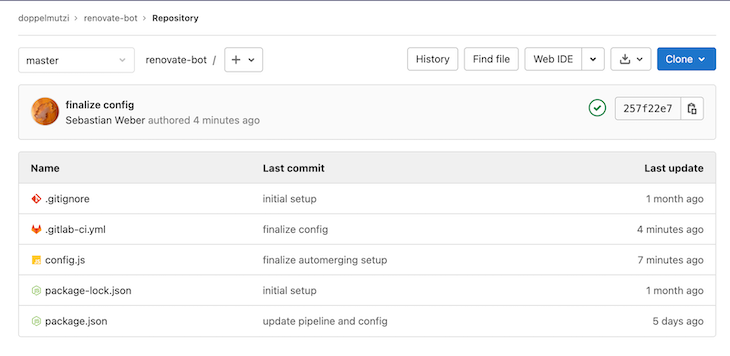


Before we look at the contents of the files, first, let's first take care of accessing other GitLab projects. To do that, we need to create a personal access token (PAT) for a GitLab account that has the access rights to the repos we want Renovate to analyze.

Click on the user's profile picture and go to the **Preferences** section. Next, go to the **Access Tokens** section and create a token with the scopes `api`, `read_user`, and `write_repository`. Give it a reasonable name and copy the token.

I prefer not to put the token directly into the source code of the pipeline file (`.gitlab-ci.yml`) and instead create an environment variable. Go to the **Settings** of your Renovate bot project, navigate to **CI/CD** and expand the **Variables** section. Click on **Add Variable**, check **mask variable**, give it a reasonable name, and paste the PAT into the value field. In my example, I use the variable name `GITLAB_PAT`.

Then, I can use the variable in the `.gitlab-ci.yml` file. The following constitutes all the code we need to get the Renovate bot up and running:

```yml
image: node:latest
check_deps:
    script:
        - export RENOVATE_TOKEN=${GITLAB_PAT}
        - npm i
        - npm run check-dependencies
```

The first line is important to have a Node environment available during the pipeline run. We define a pipeline step `check_deps`. In the `script` section, we need to set an environment variable called `RENOVATE_TOKEN` with the aforementioned PAT to grant Renovate access to the repos we want to process.

Of course ,I can name the CI/CD variable `RENOVATE_TOKEN` and skip the extra `export` line, but I prefer this way to improve traceability. To get more information about GitLab CI/CD, you can find out more in the [official doc](https://docs.gitlab.com/ee/ci/quick_start/)[s](https://docs.gitlab.com/ee/ci/quick_start/).

There are several ways to set up a GitHub self-hosted Renovate bot, but in this example, we choose to do it with npm. We install all dependencies with `npm i` and then run an npm script called `check-dependencies`.

The `package.json` file just adds Renovate as a dev dependency and provides an npm script to invoke the Renovate CLI tool:

```json
{
    "name": "renovate-bot",
    "devDependencies": {
        "renovate": "*"
    },
    "scripts": {
        "check-dependencies": "renovate",
    }
}
```

We choose to use `*` to install the most recent version every time the pipeline runs. The Renovate configuration is located in `config.js`:

```javascript
module.exports = {
    platform: 'gitlab',
    endpoint: 'https://gitlab.com/api/v4/',
    gitLabAutomerge: true,
    onboardingConfig: {
        extends: ['config:base'],
    },
    repositories: [
        'doppelmutzi/react-playground'
    ],
    packageRules: [
        {
            matchUpdateTypes: ["patch", "pin"],
            automerge: true
        }
    ],
} 
```

The first three lines are GitLab-specific; the rest is identical to the approach described above.

Finally, you need to add the user to the member section of every repo (or to the GitLab group) with the rights to create MRs with the role Developer or Maintainer.

### Invoke the Renovate bot manually

We can run the bot manually by starting the main pipeline.


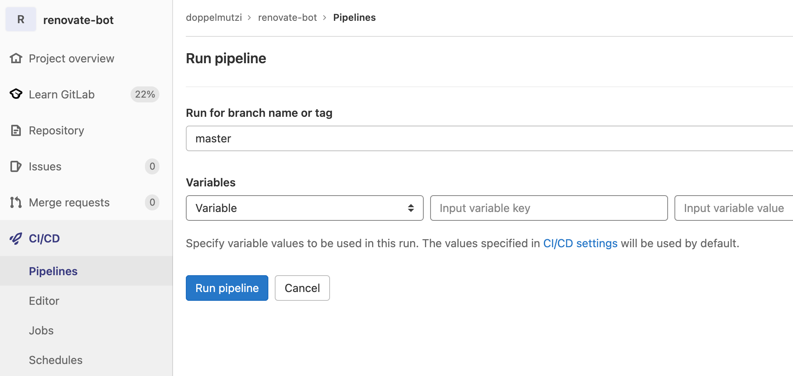


Click **CI/CD**, then click the **Run pipeline** button and run the pipeline for the main branch. If the setup was correct, the pipeline step should be green.
 

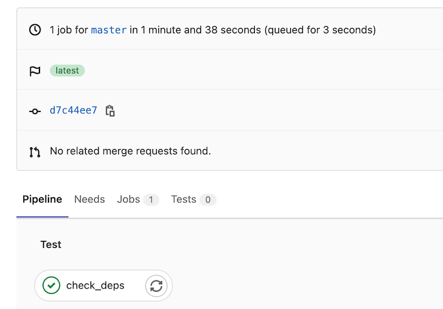

### Running the Renovate bot periodically

You can configure different aspects of Renovate in different ways. As an example, I’ll describe an alternative approach to defining a schedule for running Renovate periodically. Instead of Renovate's schedule option, we define a [pipeline schedule](https://docs.gitlab.com/ee/ci/pipelines/schedules.html). Go to the **CI/CD Schedules** section (project schedule) and create a new schedule.


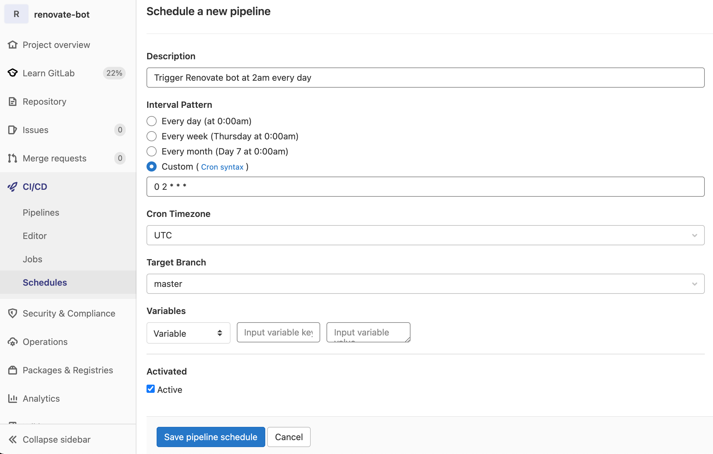


With this in place, the main pipeline of our project representing the Renovate bot runs on a daily basis at 2 AM.


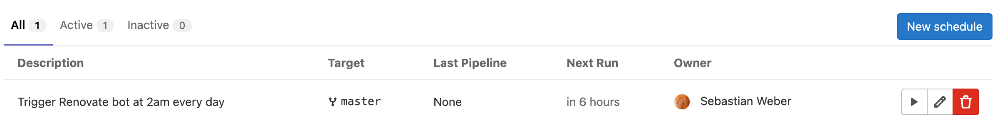


This pipeline will run whenever you commit to the main branch, too.

### Retrieving release notes from GitHub

In order to [integrate release notes](https://docs.renovatebot.com/self-hosting/#githubcom-token-for-release-notes) into MRs as shown above with the GitHub Renovate app, you need to [add a read-only PAT](https://stackoverflow.com/questions/42652815/github-access-token-with-read-only-access-to-private-repositories/42653410#42653410). Indeed, creating a dedicated GitHub account only to create a PAT for Renovate is a valid option

To have a PAT at hand, you need to sign in to GitHub and go to the [PAT section](https://github.com/settings/tokens) under the developer settings. Click the **Generate new token** button, give it a reasonable note, and check the `public_repo` option in the `repo` section. Now copy the generated token.

Next up, we create a CI/CD environment variable to integrate it into GitLab's pipeline without revealing the token directly in the codebase. We just have to make sure that we set an [environment variable](https://github.com/renovatebot/renovate/blob/main/docs/usage/self-hosting.md#githubcom-token-for-release-notes) named `GITHUB_COM_TOKEN`.

In our GitLab project, we navigate to the CI/CD section (**Settings** > **CI/CD**) and expand the **Variables** section. We need to add a variable and paste our generated GitHub token as the value. We can use `GITHUB_COM_TOKEN` as the name and we’re be good to go.

I prefer to give it a different name and create this environment variable inside of `.gitlab-ci.yml` to improve traceability for my fellow developers. Let's say I created a variable named `RELEASE_NOTES_GITHUB_PAT` (I also check **mask variable**). I would use it as follows:

```yml
check_deps:
    script:
        - export GITHUB_COM_TOKEN=${RELEASE_NOTES_GITHUB_PTA}
        - export RENOVATE_TOKEN=${GITLAB_PAT}
        - npm i
        - npm run check-dependencies
```

With the environment variable in place, release notes are integrated into every MR. The CI/CD variable section looks like this:


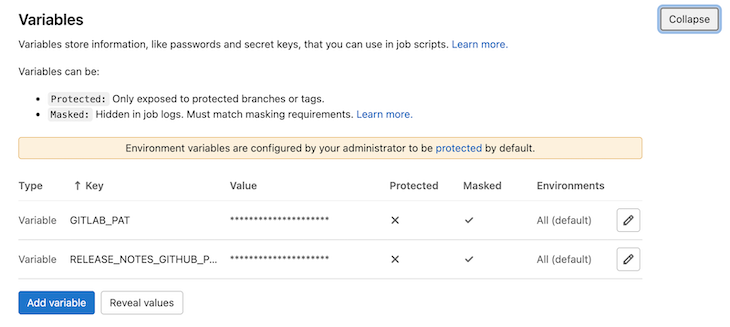

### Auto-merging and MR approvals

As I described in the GitHub section, Renovate cannot automatically merge MRs when you configured mandatory approvals for merge requests. In contrast to using the GitHub Renovate app, at the time of writing, there is no possibility to get around this obstacle in GitLab except configuring approvals as optional.

### Debugging capabilities

If you try a new configuration, you can increase the [log level](https://github.com/trentm/node-bunyan#levels) to `debug` in order to get more information from the [Renovate logging module](https://docs.renovatebot.com/self-hosting/#logging). Usually, it is too verbose for daily use.

Another helpful practice is to perform a [dry run](https://docs.renovatebot.com/self-hosted-configuration/#dryrun) instead of performing actual operations. The following extract from `.gitlab-ci.yml` lets Renovate run in dry mode for all branches except `master` in combination with an increased log level.

```yml
check_deps_dry_run:
    script:
        - export LOG_LEVEL=debug
        - export GITHUB_COM_TOKEN=${RELEASE_NOTES_GITHUB_PAT}
        - export RENOVATE_TOKEN=${GITLAB_PAT}
        - npm i
        - npm run validate-config
        - npm run check-dependencies -- --dry-run=true
    except:
        - master
```

It’s also useful to validate the provided configuration file. The command `npm run validate-config` from above calls an npm script named `validate-config` in `package.json`.

```json
{
    "scripts": {
        "check-dependencies": "renovate",
        "validate-config": "renovate-config-validator config.js"
    }
}
```
It utilizes the inbuilt `renovate-config-validator` tool to check our config file for wrong configurations. You can find any issues in the pipeline job output.

### Merge conflicts get fixed automatically

If an MR gets merged, sooner or later the situation will arise that another MR can no longer be merged due to conflicts with the previous merge.


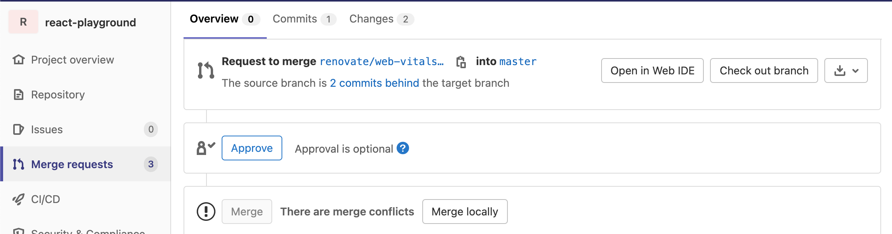


Very often the conflict is located in `package.json` files (multiple entries of the same library with different versions). The next time Renovate runs, it will identify and resolve these conflicts by using the most recent versions of the affected dependencies.

In short, most of the time, you don't need to solve these conflicts manually.

## Final setup

To wrap this article up, this section shows the final setup for the GitLab Renovate bot.
Here are the contents of `.gitlab-ci.yml`:

```yml
image: node:latest
check_deps:
script:
    - export GITHUB_COM_TOKEN=${RELEASE_NOTES_GITHUB_PAT}
    - export RENOVATE_TOKEN=${GITLAB_PAT}
    - npm i
    - npm run validate-config
    - npm run check-dependencies
only:
    - master
check_deps_dry_run:
script:
    - export LOG_LEVEL=debug
    - export GITHUB_COM_TOKEN=${RELEASE_NOTES_GITHUB_PAT}
    - export RENOVATE_TOKEN=${GITLAB_PAT}
    - npm i
    - npm run validate-config
    - npm run check-dependencies -- --dry-run=true
except:
    - master
```

Our `package.json` looks like this:

```json
{
    "name": "renovate-bot",
    "devDependencies": {
        "renovate": "*"
    },
    "scripts": {
        "check-dependencies": "renovate",
        "validate-config": "renovate-config-validator config.js"
    }
}
```

And the Renovate configuration (`config.js`) has the following form:

```javascript
module.exports = {
    platform: 'gitlab',
    endpoint: 'https://gitlab.com/api/v4/',
    gitLabAutomerge: true,
    onboardingConfig: {
        extends: ['config:base'],
    },
    repositories: [
        'doppelmutzi/react-playground'
    ],
    packageRules: [
        {
            matchUpdateTypes: ["patch", "pin"],
            automerge: true
        }
    ],
} 
```
